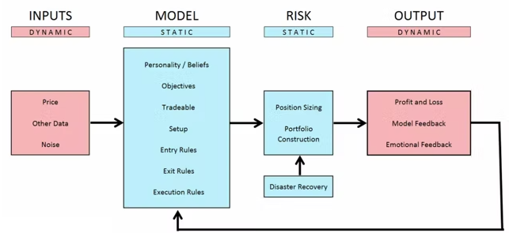
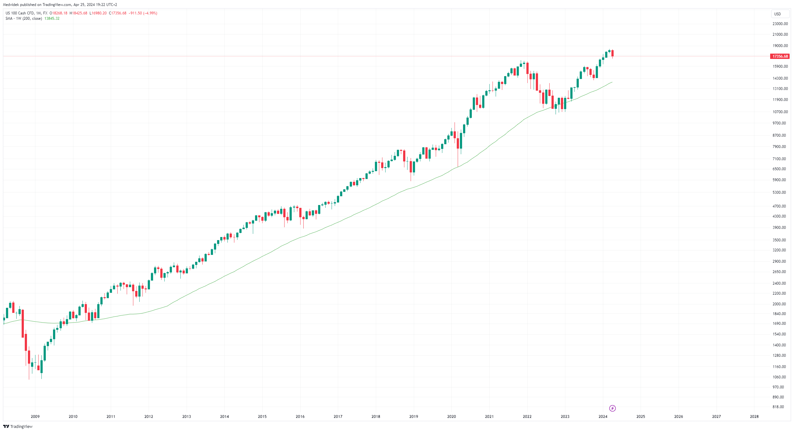

# trend-follow.io

This open source project is about momentum base trend following systematic trading strategies inspired from top trend following traders (Richard Denis, Olivier Seban and Nick Radge) implemented for various trading platforms as TradingView, cTrader, MetaTrader, Multicharts and TradeStation.

## System Design Considerations
Here is a flow chart diagram uses to explain fundamental ideas and thesis around system design.

## What is trend following?

Trend following is when you try to capture extended moves in the financial markets, either up or down, mostly for long-term gains. Once in a while prices tend to keep on going (enduring) and these are the moves trend followers like. The aim is to capture most of such moves, not all, but the majority of them.

Trend followers are not trying to predict tops and bottoms. They are not trying to predict anything, really. The aim is, quite simply, to take advantage of moves in different asset classes in the anticipation that some of the positions go their way big time. There is zero forecasting involved.

Trend followers might use different time frames and many asset classes to diversify in order to avoid big drawdowns. Having different strategies is important for a trend follower.

**Basic rules of trend following**

1. Follow the trend.
2. Quickly exit losing trades at relatively small stop-losses.
3. Let the profits grow until the trend ends.

These three principles are the basic building blocks of all successful trend following strategies. That's not the point
to predict where the market will go, but rather to react to its changes. The goal is to use the big and prominent ones to our advantage
market movements.

> "Being fully invested when the market is rising and reverting to cash during a sustained bear market
is not about predicting or timing the market. It’s about reacting to the current market trend and then
positioning oneself accordingly." Nick Radge

## What is a trend?

A trend refers to the general direction in which the price of an asset is moving over a period of time. Trends can be classified as upward (bullish), downward (bearish), or sideways (neutral). Traders often try to identify and follow trends to make informed decisions about buying or selling assets.

Example long-term uptrend on index Nasdaq 100

## Trend follow strategies

### Turtle trend follow
The Turtle Trading strategy was developed by Richard Dennis and William Eckhardt in the early 1980s. Story
relates that Richard Dennis, a successful commodity trader, believed that trading could be taught to anyone and decided
to conduct an experiment to confirm his theory. He created a group of people known as the "Turtles" and taught them his trade
system.

The basic principle of the Turtle Trading strategy is to follow the trend. The goal is to identify and trade strong trends on
financial markets. Turtles learned to buy and hold futures contracts for markets that were in a strong uptrend
and sell short and hold contracts for markets in a strong downtrend. Personally, I think it's better
focus on markets in a long-term up-trend and trade only on the long side.

Author: Richard Denis

- [Documentation](strategies/trend-follow/TurtleTrendFollow/README.md)
- [Backtest](strategies/trend-follow/TurtleTrendFollow/backtest/backtest.md)
- **SourceCode**: [TradingView](strategies/trend-follow/TurtleTrendFollow/scripts/TurtleTrendFollowStrategy.pinescript), [cTrader](strategies/trend-follow/TurtleTrendFollow/scripts/TurtleTrendFollowStrategy.cs) [MetaTrader](strategies/trend-follow/TurtleTrendFollow/scripts/TurtleTrendFollowStrategy.mq5), [Multicharts](strategies/trend-follow/TurtleTrendFollow/scripts/TurtleTrendFollowStrategy.easylanguage), [TradeStation](strategies/trend-follow/TurtleTrendFollow/scripts/TurtleTrendFollowStrategy.easylanguage)

### Super trend follow
The Supertrend Strategy is a trend trading strategy that uses the Supertrend indicator to identify and trade trends in the financial markets. This strategy focuses on entering the market in line with the main trend and exiting the market when the trend begins to reverse.

The basis of the Supertrend strategy is the Supertrend indicator, which determines the direction of the trend and potential entry and exit points. The Supertrend indicator generates signals based on current price data and a certain volatility factor.

Author: Olivier Seban

- [Documentation](strategies/trend-follow/SuperTrendFollow/README.md)
- [Backtest](strategies/trend-follow/SuperTrendFollow/backtest/backtest.md)
- **SourceCode**: [TradingView](strategies/trend-follow/SuperTrendFollow/scripts/SuperTrendFollowStrategy.pinescript), [cTrader](strategies/trend-follow/SuperTrendFollow/scripts/SuperTrendFollowStrategy.cs) [MetaTrader](strategies/trend-follow/SuperTrendFollow/scripts/SuperTrendFollowStrategy.mq5), [Multicharts](strategies/trend-follow/SuperTrendFollow/scripts/SuperTrendFollowStrategy.easylanguage), [TradeStation](strategies/trend-follow/SuperTrendFollow/scripts/SuperTrendFollowStrategy.easylanguage)

### Bollinger band trend follow
The purpose of this strategy is to use the Bollinger Bands to generate trading signals designed to capture powerful breakout price moves and to capitalize on the resulting trends from these breakouts.

The Bollinger Bands are often used for the purpose of generating signals to determine when price is entering over-sold or over-bought areas on the chart, relative to recent price. This strategy utilizes the Bollinger Bands in a completely different way – to identify breakout trade opportunities which often lead to price trending in a defined direction for an extended period of time.

Author: Nick Radge
- [Documentation](strategies/trend-follow/BollingerBandTrendFollow/README.md)
- [Backtest](strategies/trend-follow/BollingerBandTrendFollow/backtest/backtest.md)
- **SourceCode**: [TradingView](strategies/trend-follow/BollingerBandTrendFollow/scripts/BollingerBandTrendFollowStrategy.pinescript), [cTrader](strategies/trend-follow/BollingerBandTrendFollow/scripts/BollingerBandTrendFollowStrategy.cs) [MetaTrader](strategies/trend-follow/BollingerBandTrendFollow/scripts/BollingerBandTrendFollowStrategy.mq5), [Multicharts](strategies/trend-follow/BollingerBandTrendFollow/scripts/BollingerBandTrendFollowStrategy.easylanguage), [TradeStation](strategies/trend-follow/BollingerBandTrendFollow/scripts/BollingerBandTrendFollowStrategy.easylanguage)

## Top trend follow traders
### Richard Dennis
Richard Dennis was an American trader who became famous as a commodity trader and creator of the strategy known as "Turtle Trading". Born in 1949 in Chicago, he showed an interest in financial markets from a young age. Dennis' career began as a stock trader, but he soon turned his attention to commodity trading, where he found his true calling.

His greatest success came in the 1980s when he and partner William Eckhardt developed and taught the Turtle Trading strategy. This strategy was based on simple rules that aimed to identify long-term trends in the markets. Dennis and Eckhardt recruited and trained a group of traders they called "turtles" and taught these people their strategy. The Turtles were then tasked with trading according to these rules in real markets.

Richard Dennis became famous for his approach to trading that emphasized discipline and psychological resilience. His story is proof that with a solid plan and discipline, success can be achieved even in volatile financial markets.

Dennis' legacy in commodity trading and his Turtle Trading strategy continue to inspire many traders around the world. Richard Dennis died in 2015, but his influence on the world of financial markets remains so strong that his name is still associated with innovative approaches to trading.

### Olivier Seban
Olivier Seban is a French trader and author who is best known for his contribution to trading in the financial markets. Born in 1970, he has specialized in technical analysis and development of trading strategies throughout his career.

His greatest contribution to trading came with the development of an indicator called "SuperTrend". This indicator is based on price movement analysis and helps traders identify the direction of the market trend. SuperTrend has become a popular tool among traders due to its simplicity and effectiveness in capturing trends.

Seban also became famous as the author of several books on trading and investing, in which he shared his knowledge and experience. His approach to trading focuses on simplicity and discipline, which are key elements of successful trading.

With his invention of SuperTrend and his approach to trading, Olivier Seban became a recognized figure in the trading world and his technical tools are still used by many traders around the world.

### Nick Radge
Nick Radge is an Australian trader, author and lecturer known for his contributions to trading in the financial markets. Born in Australia, he has specialized throughout his career in systematic trading using technical analysis and quantitative methods.

His most famous book is called "Unholy Grails: A New Road to Wealth" where Radge shares his experiences and approaches to trading. In the book, he describes his trading strategies in detail and provides useful advice on how to minimize risk and maximize profits when trading the financial markets.

Nick Radge is also known for his work in auto trading and algorithmic trading. He helped create trading systems and algorithms that enable trading in the markets with minimal human intervention.

Thanks to his approach to trading and his emphasis on systematic methods, Nick Radge has become a recognized authority in the field of trading. His books, articles and seminars are valued among traders around the world who are looking for practical and effective approaches to trading the financial markets.

### Michael Covel
Michael Covel is an American trader, author, entrepreneur and lecturer, best known for his work in trend trading and systematic strategies. Born in 1968, he has become a recognized authority on trend trading throughout his career.

His most famous book is called "Trend Following: How to Make a Fortune in Bull, Bear, and Black Swan Markets". In this book, Covel explores the principles of trend trading and shares success stories of traders who use this strategy.

Covel is also known for his podcast called "Trend Following Radio", where he hosts leading figures in the field of trading and investing and discusses trend trading, financial markets and investment strategies.

Through his work and publications, Michael Covel has become an influential figure in the field of trend trading and his approach has inspired many traders and investors around the world.

## Podcasts - Trend following blueprint
* [Nick Radge - The Blueprint: Create a Simple Trend Following System](https://open.spotify.com/episode/0zPLuDKFafJDC4rcPvigbM?si=c0023e05ee22495b)
* [064: Nick Radge – The Casino Edge, Mean Reversion Strategies, and How to Develop Robust Trading Systems](https://open.spotify.com/episode/1gMgeQIY2X17uD9zkDNGXl?go=1&sp_cid=908e4404091f9d794d6844fc89bae1bf&utm_source=embed_player_p&utm_medium=desktop)
* [166: Consistent Equity Growth using Diversification – Nick Radge](https://open.spotify.com/embed/episode/38VBtSW9O3LlQsq7u7934L)
* [004: Nick Radge – How to Power Through Trading Losses and Continue Executing](https://open.spotify.com/embed/episode/50P19y3hKtEycYP87qHSqJ)
* [004: Nick Radge discusses system design, the best type of trading systems, handling a bear market, measuring performance and the difference between successful traders and everyone else.](https://open.spotify.com/embed/episode/3XihZiuRDBNIKLRBEJc30f)

## Books - About trend following
* [The Complete TurtleTrader](https://www.amazon.com/dp/B000W94CZ8?ref_=cm_sw_r_kb_dp_JESRFYYZAPP9YX59MA84&tag=kpembed-20&linkCode=kpe)
* [Unholy Grails - A New Road to Wealth](https://www.amazon.com/dp/B007T97DJQ?ref_=cm_sw_r_kb_dp_8H0QD7JVB38VWZG1XMGA&tag=kpembed-20&linkCode=kpe)
* [Weekend Trend Trader](https://www.amazon.com/dp/B00F4P0OWA?ref_=cm_sw_r_kb_dp_GA3J5SGW35XW8RWX21HQ&tag=kpembed-20&linkCode=kpe)
* [Trend Following: How to Make a Fortune in Bull, Bear, and Black Swan Markets (Wiley Trading)](https://www.amazon.com/dp/B06Y63RDS2?ref_=cm_sw_r_kb_dp_8SJ3XXZX75AQPNFZV0PN&tag=kpembed-20&linkCode=kpe)
* [Trend Following Mindset: The Genius of Legendary Trader Tom Basso](https://www.amazon.com/dp/B08TRN5LRT?ref_=cm_sw_r_kb_dp_A29QMGVX07EC2P47T8KW&tag=kpembed-20&linkCode=kpe)

## Contributors
<!-- ALL-CONTRIBUTORS-LIST:START - Do not remove or modify this section -->
<!-- prettier-ignore-start -->
<!-- markdownlint-disable -->
<table>
  <tr>
     <td align="center"><a href="https://github.com/GeorgeFreelanceDeveloper"> <b>GeorgeFreelanceDeveloper</b></a> <a href="https://github.com/GeorgeFreelanceDeveloper" title="Ideas">🤔</a></td>
    <td align="center"><a href="https://github.com/LucyFreelanceDeveloper"> <b>LucyFreelanceDeveloper</b></a> <a href="https://github.com/LucyFreelanceDeveloper" title="Code">💻</a></td>
  </tr>
</table>

