# Markets
Updated 7.7.2024

The article describes markets suitable for trading the long only trend follow strategies. Markets that are in a long-term growth trend and have strong momentum are suitable for long-only trend strategies, such as the cryptocurrency Bitcoin, the Nasdaq stock index or selected top performing stocks this year.

**Table of Contents**
* [Markets in long-term up trend](#markets-in-long-term-up-trend)
    * [Bitcoin](#bitcoin)
    * [Etherem](#ethereum)
    * [NAS 100](#nasdaq-100)
    * [S&P 500](#s&p-500)
    * [NIFTY 50](#nifty-50)
* [Top 10 US stocks by momentum](#top-10-us-stocks-by-momentum)
    * [Intro into selecting stocks](#intro-into-selecting-stocks)
    * [Super Micro Computer](#super-micro-computer)
    * [NVIDIA](#nvidia)
    * [Vistra corp](#vistra-corp)
    * [Constellation Energy Corporation](#constellation-energy-corporation)
    * [Micron technology](#micron-technology)
    * [NRG energy](#nrg-energy)
    * [Eli Lilly and Company](#eli-lilly-and-company)
    * [CrowdStrike Holdings](#crowdstrike-holdings)
    * [Arista Networks](#arista-networks)
    * [NetApp](#netapp)

## Markets in long-term up trend

### Bitcoin
Bitcoin (BTC) is a decentralized cryptocurrency that was first described in a 2008 whitepaper by an individual or group of individuals using the alias Satoshi Nakamoto. Officially launched in January 2009, Bitcoin is a peer-to-peer online currency that allows transactions to happen directly between equal and independent network participants without the need for any intermediary. Bitcoin is digital money that cannot be inflated or manipulated by any individual, company, government, or central bank. Bitcoin is recognized as one of the initial cryptocurrencies to come into use and has inspired the development of thousands of competing projects. There will only ever be 21 million BTC. Bitcoin is highly divisible, with its smallest unit, i.e. 0.000 000 01 BTC, called a "satoshi" or "sat." As bitcoin's value has risen, its easy divisibility has become a key attribute.

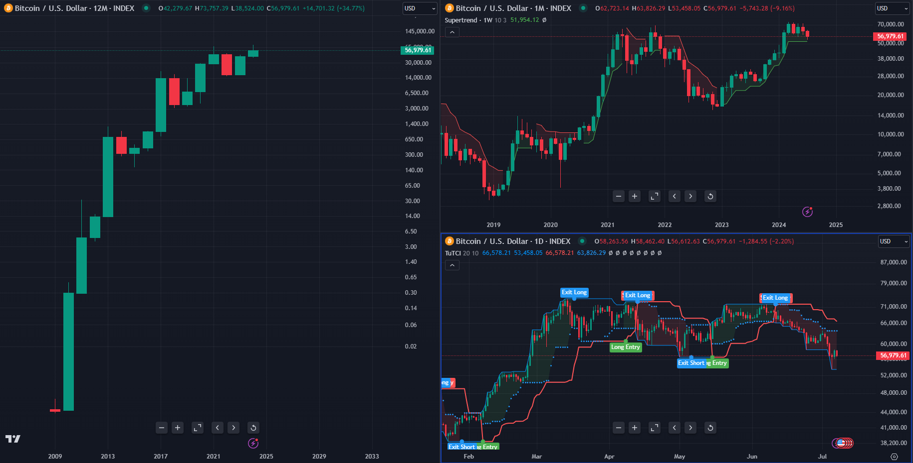

<table class="table">
  <thead>
    <tr>
      <th scope="col">Market</th>
      <th scope="col">Perf All Time > 0%</th>
      <th scope="col">Perf 10Y</th>
      <th scope="col">Perf 5Y</th>
      <th scope="col">Perf YTD</th>
      <th scope="col">Price above 200D SMA</th>
    </tr>
  </thead>
  <tbody>
    <tr>
      <th scope="row">Bitcoin</th>
      <td>True</td>
      <td>9 151%</td>
      <td>363%</td>
      <td>34%</td>
      <td>False</td>
    </tr>
  </tbody>
</table>

### Ethereum
Ethereum is a decentralized, open-source blockchain platform that enables the creation and execution of smart contracts and decentralized applications (dApps) without any downtime, fraud, control, or interference from a third party. Launched in 2015 by Vitalik Buterin and other developers, Ethereum extends the capabilities of Bitcoin's blockchain technology by incorporating a built-in programming language that allows developers to write their own code and create personalized applications. Ether (ETH) is the platform's native cryptocurrency, which is used to pay for transaction fees and computational services on the Ethereum network.

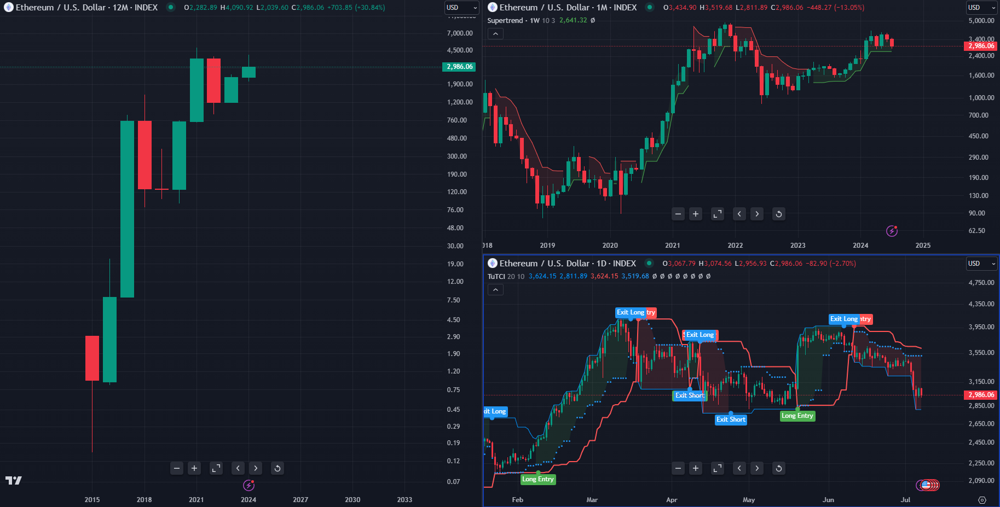

<table class="table">
  <thead>
    <tr>
      <th scope="col">Market</th>
      <th scope="col">Perf All Time > 0%</th>
      <th scope="col">Perf 10Y</th>
      <th scope="col">Perf 5Y</th>
      <th scope="col">Perf YTD</th>
      <th scope="col">Price above 200D SMA</th>
    </tr>
  </thead>
  <tbody>
    <tr>
      <th scope="row">Ethereum</th>
      <td>True</td>
      <td>298 827%</td>
      <td>853%</td>
      <td>30%</td>
      <td>False</td>
    </tr>
  </tbody>
</table>

### Nasdaq 100
The Nasdaq 100 Index is a benchmark stock market index comprising 100 of the largest non-financial companies listed on the Nasdaq Stock Market, a premier global electronic marketplace for buying and selling securities. Launched in 1985, the index includes diverse sectors such as technology, consumer services, healthcare, and biotechnology, with a significant emphasis on technology-driven firms. Renowned for its high growth potential and innovation, the Nasdaq 100 features prominent companies like Apple, Microsoft, Amazon, and Alphabet (Google). The index is often used as a barometer for the performance of the technology and innovation sectors within the U.S. stock market.

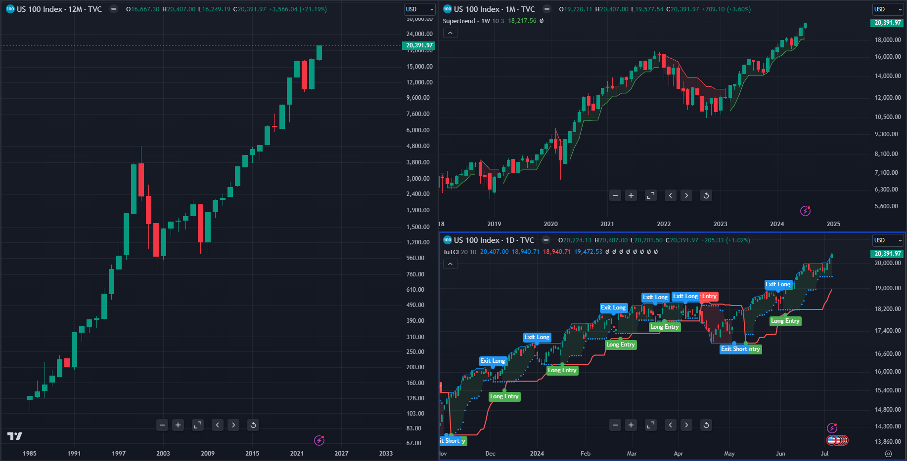

<table class="table">
  <thead>
    <tr>
      <th scope="col">Market</th>
      <th scope="col">Perf All Time > 0%</th>
      <th scope="col">Perf 10Y</th>
      <th scope="col">Perf 5Y</th>
      <th scope="col">Perf YTD</th>
      <th scope="col">Price above 200D SMA</th>
    </tr>
  </thead>
  <tbody>
    <tr>
      <th scope="row">Nasdaq 100</th>
      <td>True</td>
      <td>420%</td>
      <td>160%</td>
      <td>22%</td>
      <td>True</td>
    </tr>
  </tbody>
</table>

### S&P 500
The S&P 500 Index, or Standard & Poor's 500 Index, is a widely regarded stock market index that tracks the performance of 500 of the largest publicly traded companies in the United States, spanning various industries and sectors. Established in 1957, it serves as a key indicator of the overall health and performance of the U.S. stock market and economy. The index is market-capitalization-weighted, meaning larger companies have a more significant impact on its performance. With its diverse representation, the S&P 500 includes companies like Apple, Microsoft, Amazon, and Johnson & Johnson, making it a common benchmark for investors and a popular investment vehicle through mutual funds and exchange-traded funds (ETFs).

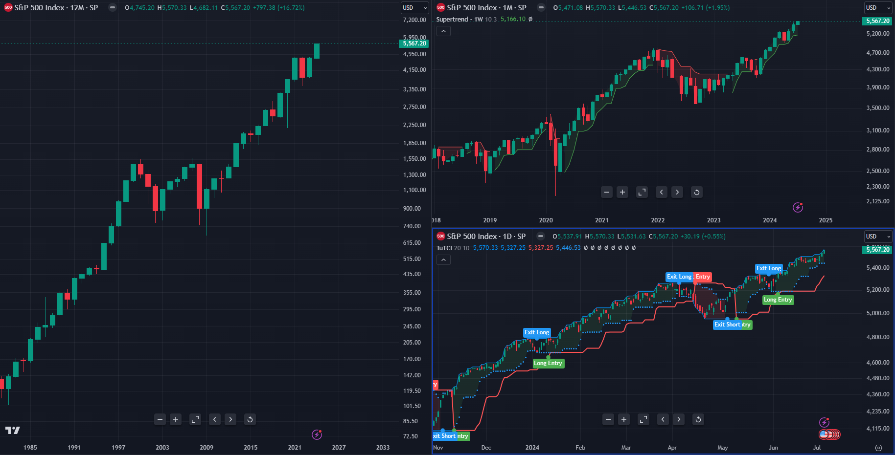

<table class="table">
  <thead>
    <tr>
      <th scope="col">Market</th>
      <th scope="col">Perf All Time > 0%</th>
      <th scope="col">Perf 10Y</th>
      <th scope="col">Perf 5Y</th>
      <th scope="col">Perf YTD</th>
      <th scope="col">Price above 200D SMA</th>
    </tr>
  </thead>
  <tbody>
    <tr>
      <th scope="row">S&P 500</th>
      <td>True</td>
      <td>181%</td>
      <td>86%</td>
      <td>17%</td>
      <td>True</td>
    </tr>
  </tbody>
</table>

### NIFTY 50
The NIFTY 50 Index is a key benchmark index for the Indian equity market, representing the weighted average of 50 of the largest and most liquid stocks listed on the National Stock Exchange of India (NSE). Introduced in 1990 by the NSE, it encompasses various sectors of the Indian economy, providing a comprehensive overview of the market's performance. The index is market-capitalization-weighted, ensuring that larger companies have a greater influence on its movements. By including major corporations such as Reliance Industries, Tata Consultancy Services (TCS), and HDFC Bank, the NIFTY 50 serves as a crucial barometer for investors and analysts assessing the economic health and trends of the Indian stock market.

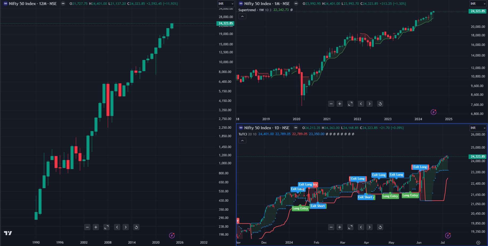

<table class="table">
  <thead>
    <tr>
      <th scope="col">Market</th>
      <th scope="col">Perf All Time > 0%</th>
      <th scope="col">Perf 10Y</th>
      <th scope="col">Perf 5Y</th>
      <th scope="col">Perf YTD</th>
      <th scope="col">Price above 200D SMA</th>
    </tr>
  </thead>
  <tbody>
    <tr>
      <th scope="row">NIFTY 50</th>
      <td>True</td>
      <td>283%</td>
      <td>124%</td>
      <td>11%</td>
      <td>True</td>
    </tr>
  </tbody>
</table>

## Top 10 US stocks by momentum

### Intro into selecting stocks
**Entry stock into portfolio**

Select top performing stocks from index S&P500 in long-term up trend with actual strong momentum.

- performance all time > 0%
- performance 10 years > 0%
- performance 5 years > 0%
- performance YTD > 0% (first quarter in year use PREVIOUS YEAR)
- daily close > 200 daily simple moving average

**Exit stock from portfolio**

Loss medium-term up trend and momentum.

- Last 2 monthly candle close below 200D SMA

### Super Micro Computer
Super Micro Computer, Inc. engages in the distribution and manufacture of information technology solutions and other computer products. Its products include twin solutions, MP servers, GPU and coprocessor, MicroCloud, AMD solutions, power supplies, SuperServer, storage, motherboards, chassis, super workstations, accessories, SuperRack and server management products. The company was founded by Charles Liang, Yih-Shyan Liaw, Sara Liu, and Chiu-Chu Liu Liang in September 1993 and is headquartered in San Jose, CA.

**Sector**: Electronic Technology

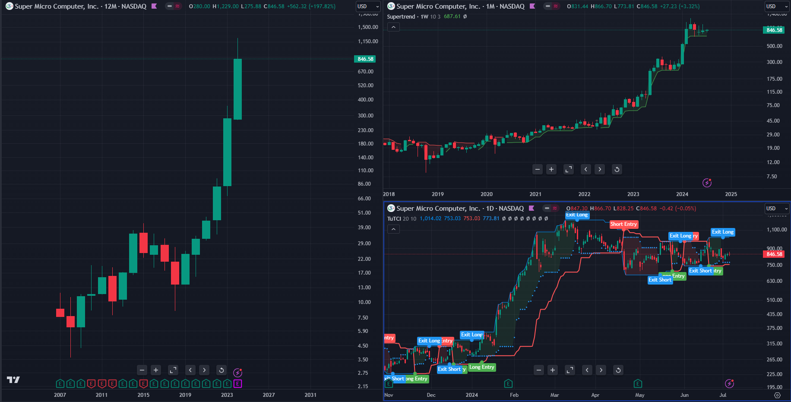

<table class="table">
  <thead>
    <tr>
      <th scope="col">Market</th>
      <th scope="col">Perf All Time > 0%</th>
      <th scope="col">Perf 10Y</th>
      <th scope="col">Perf 5Y</th>
      <th scope="col">Perf YTD</th>
      <th scope="col">Price above 200D SMA</th>
    </tr>
  </thead>
  <tbody>
    <tr>
      <th scope="row">SMCI</th>
      <td>True</td>
      <td>3 236%</td>
      <td>4 379%</td>
      <td>202%</td>
      <td>True</td>
    </tr>
  </tbody>
</table>

### NVIDIA
NVIDIA Corp engages in the design and manufacture of computer graphics processors, chipsets, and related multimedia software. It operates through the following segments: Graphics Processing Unit (GPU), Tegra Processor, and All Other. The GPU segment comprises of product brands, which aims specialized markets including GeForce for gamers; Quadro for designers; Tesla and DGX for AI data scientists and big data researchers; and GRID for cloud-based visual computing users. The Tegra Processor segment integrates an entire computer onto a single chip, and incorporates GPUs and multi-core CPUs to drive supercomputing for autonomous robots, drones, and cars, as well as for consoles and mobile gaming and entertainment devices. The All Other segment refers to the stock-based compensation expense, corporate infrastructure and support costs, acquisition-related costs, legal settlement costs, and other non-recurring charges. The company was founded by Jen Hsun Huang, Chris A. Malachowsky, and Curtis R. Priem in January 1993 and is headquartered in Santa Clara, CA.

**Sector**: Electronic Technology

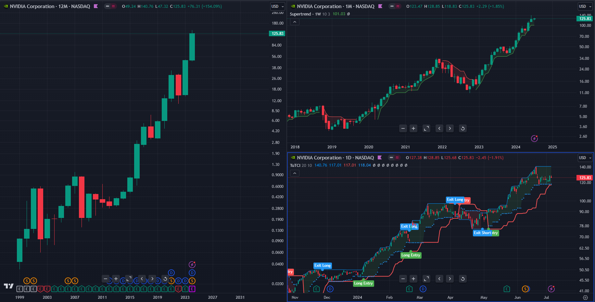

<table class="table">
  <thead>
    <tr>
      <th scope="col">Market</th>
      <th scope="col">Perf All Time > 0%</th>
      <th scope="col">Perf 10Y</th>
      <th scope="col">Perf 5Y</th>
      <th scope="col">Perf YTD</th>
      <th scope="col">Price above 200D SMA</th>
    </tr>
  </thead>
  <tbody>
    <tr>
      <th scope="row">NVDA</th>
      <td>True</td>
      <td>26 887%</td>
      <td>3 037%</td>
      <td>155%</td>
      <td>True</td>
    </tr>
  </tbody>
</table>

### Vistra Corp
Vistra Corp. is a holding company, which engages in the provision of electricity and power generation. It operates through the following segments: Retail, Texas, East, West, Sunset, and Asset Closure. The Retail segment sells electricity and natural gas to residential, commercial, and industrial customers. The Texas and East segments are involved in electricity generation, wholesale energy sales and purchases, commodity risk management activities, fuel production and fuel logistics management. The West segment represents the company's electricity generation operations in CAISO. The Sunset segment includes generation plants with announced retirement plans. The Asset Closure segment refers to the decommissioning and reclamation of retired plants and mines. The company was founded in 1882 and is headquartered in Irving, TX.

**Sector**: Utilities

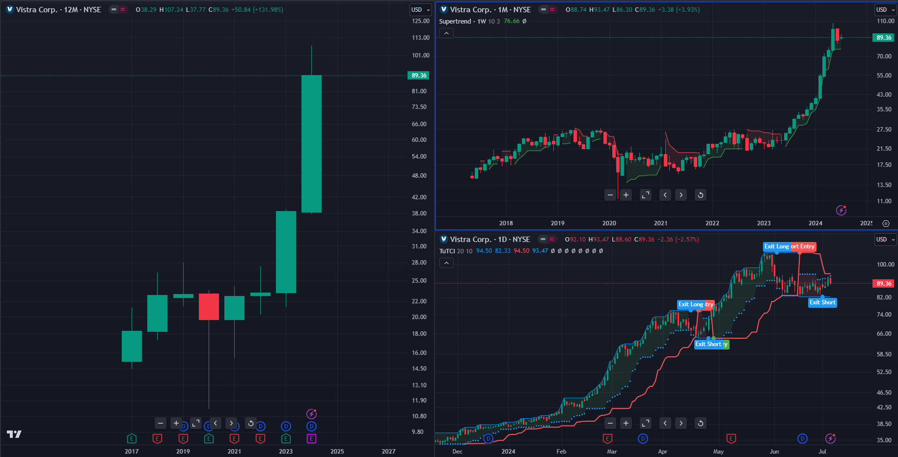

<table class="table">
  <thead>
    <tr>
      <th scope="col">Market</th>
      <th scope="col">Perf All Time > 0%</th>
      <th scope="col">Perf 10Y</th>
      <th scope="col">Perf 5Y</th>
      <th scope="col">Perf YTD</th>
      <th scope="col">Price above 200D SMA</th>
    </tr>
  </thead>
  <tbody>
    <tr>
      <th scope="row">VST</th>
      <td>True</td>
      <td>491%</td>
      <td>297%</td>
      <td>133%</td>
      <td>True</td>
    </tr>
  </tbody>
</table>

### Constellation Energy Corporation
Constellation Energy Corp. engages in the generation, supply, and marketing of clean electricity, and renewable energy products and solutions. The firm also offers wholesale energy, retail products and services. It operates under the following geographical segments: Mid-Atlantic, Midwest, New York, Electric Reliability Council of Texas (ERCOT), and Other Power Regions Segment. The company was founded in 1960 and is headquartered in Baltimore, MD.

**Sector**: Utilities

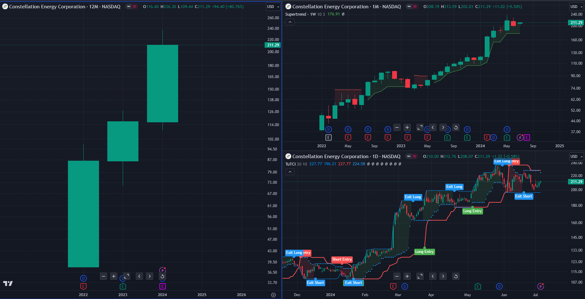

<table class="table">
  <thead>
    <tr>
      <th scope="col">Market</th>
      <th scope="col">Perf All Time > 0%</th>
      <th scope="col">Perf 10Y</th>
      <th scope="col">Perf 5Y</th>
      <th scope="col">Perf YTD</th>
      <th scope="col">Price above 200D SMA</th>
    </tr>
  </thead>
  <tbody>
    <tr>
      <th scope="row">CEG</th>
      <td>True</td>
      <td>456%</td>
      <td>456%</td>
      <td>81%</td>
      <td>True</td>
    </tr>
  </tbody>
</table>

### Micron Technology
Constellation Energy Corp. engages in the generation, supply, and marketing of clean electricity, and renewable energy products and solutions. The firm also offers wholesale energy, retail products and services. It operates under the following geographical segments: Mid-Atlantic, Midwest, New York, Electric Reliability Council of Texas (ERCOT), and Other Power Regions Segment. The company was founded in 1960 and is headquartered in Baltimore, MD.

**Sector**: Electronic Technology

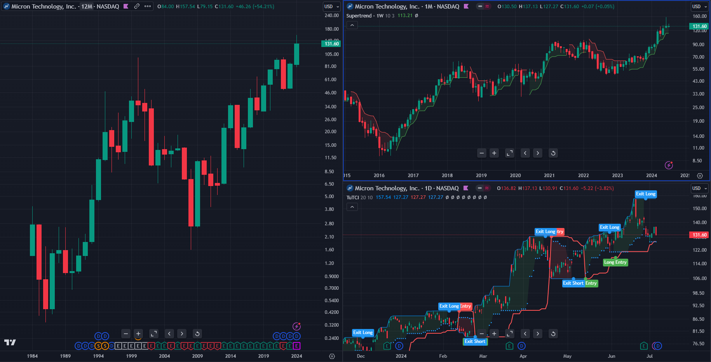

<table class="table">
  <thead>
    <tr>
      <th scope="col">Market</th>
      <th scope="col">Perf All Time > 0%</th>
      <th scope="col">Perf 10Y</th>
      <th scope="col">Perf 5Y</th>
      <th scope="col">Perf YTD</th>
      <th scope="col">Price above 200D SMA</th>
    </tr>
  </thead>
  <tbody>
    <tr>
      <th scope="row">MU</th>
      <td>True</td>
      <td>301%</td>
      <td>237%</td>
      <td>56%</td>
      <td>True</td>
    </tr>
  </tbody>
</table>

### NRG Energy, Inc.
NRG Energy, Inc. engages in the production, sale, and distribution of energy and energy services. It operates through the following segments: Generation, Retail, and Corporate. The Generation segment includes all power plant activities, domestic and international, as well as renewables. The Retail segment includes mass customers and business solutions, and other distributed and reliability products. The Corporate segment includes residential solar and electric vehicle services. The company was founded in 1989 and is headquartered in Houston, TX.

**Sector**: Utilities

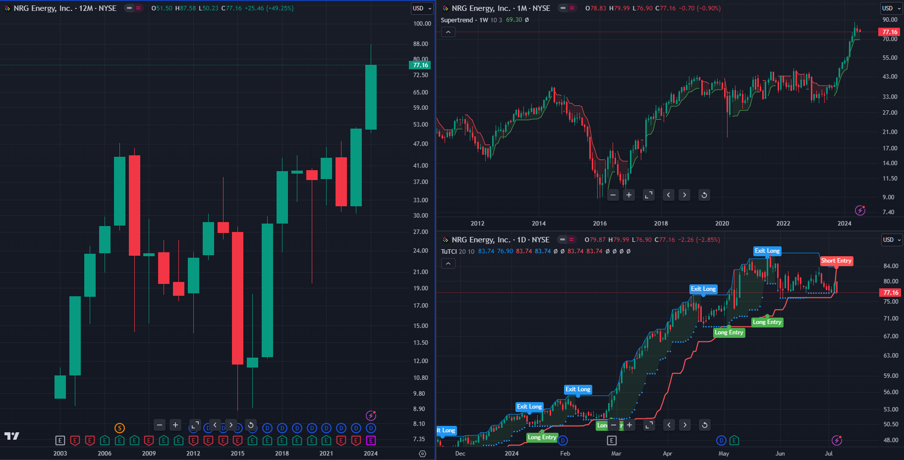

<table class="table">
  <thead>
    <tr>
      <th scope="col">Market</th>
      <th scope="col">Perf All Time > 0%</th>
      <th scope="col">Perf 10Y</th>
      <th scope="col">Perf 5Y</th>
      <th scope="col">Perf YTD</th>
      <th scope="col">Price above 200D SMA</th>
    </tr>
  </thead>
  <tbody>
    <tr>
      <th scope="row">NRG</th>
      <td>True</td>
      <td>120%</td>
      <td>116%</td>
      <td>49%</td>
      <td>True</td>
    </tr>
  </tbody>
</table>

### Eli Lilly and Company
Eli Lilly & Co. engages in the discovery, development, manufacture, and sale of pharmaceutical products. The firm's products consist of diabetes, oncology, immunology, neuroscience, and other products and therapies. The company was founded by Eli Lilly in May 1876 and is headquartered in Indianapolis, IN.

**Sector**: Health Technology

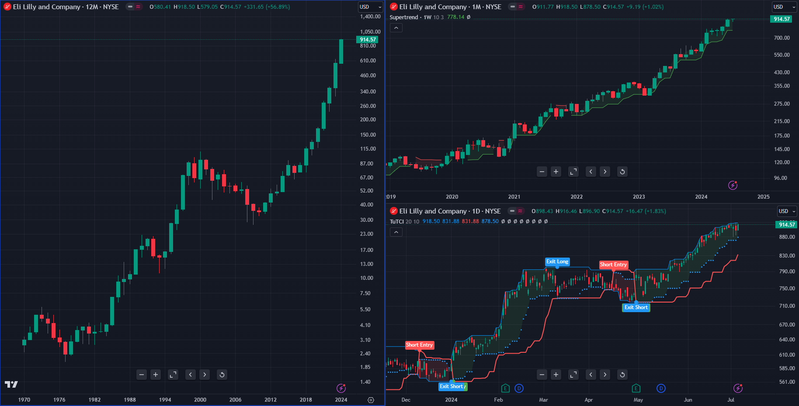

<table class="table">
  <thead>
    <tr>
      <th scope="col">Market</th>
      <th scope="col">Perf All Time > 0%</th>
      <th scope="col">Perf 10Y</th>
      <th scope="col">Perf 5Y</th>
      <th scope="col">Perf YTD</th>
      <th scope="col">Price above 200D SMA</th>
    </tr>
  </thead>
  <tbody>
    <tr>
      <th scope="row">LLY</th>
      <td>True</td>
      <td>1363%</td>
      <td>701%</td>
      <td>57%</td>
      <td>True</td>
    </tr>
  </tbody>
</table>

### CrowdStrike Holdings, Inc.
CrowdStrike Holdings, Inc. provides cybersecurity products and services to stop breaches. It offers cloud-delivered protection across endpoints, cloud workloads, identity and data, and threat intelligence, managed security services, IT operations management, threat hunting, Zero Trust identity protection, and log management. CrowdStrike serves customers worldwide. The company was founded by George P. Kurtz, Gregg Marston, and Dmitri Alperovitch on November 7, 2011, and is headquartered in Austin, TX.

**Sector**: Technology Services

<table class="table">
  <thead>
    <tr>
      <th scope="col">Market</th>
      <th scope="col">Perf All Time > 0%</th>
      <th scope="col">Perf 10Y</th>
      <th scope="col">Perf 5Y</th>
      <th scope="col">Perf YTD</th>
      <th scope="col">Price above 200D SMA</th>
    </tr>
  </thead>
  <tbody>
    <tr>
      <th scope="row">CRWD</th>
      <td>True</td>
      <td>510%</td>
      <td>470%</td>
      <td>54%</td>
      <td>True</td>
    </tr>
  </tbody>
</table>

### Arista Networks
Arista Networks, Inc. engages in the business of developing, marketing, and selling cloud networking solutions. The firm is also involved in switching and routing platforms and related network applications. The company was founded by Andreas Bechtolsheim, David Cheriton, and Kenneth Duda in November 2004 and is headquartered in Santa Clara, CA.

**Sector**: Electronic Technology

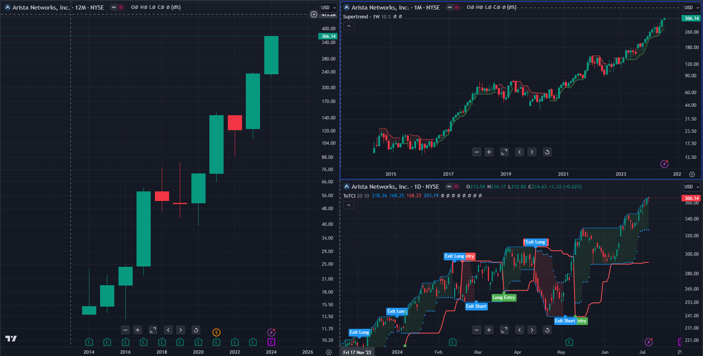

<table class="table">
  <thead>
    <tr>
      <th scope="col">Market</th>
      <th scope="col">Perf All Time > 0%</th>
      <th scope="col">Perf 10Y</th>
      <th scope="col">Perf 5Y</th>
      <th scope="col">Perf YTD</th>
      <th scope="col">Price above 200D SMA</th>
    </tr>
  </thead>
  <tbody>
    <tr>
      <th scope="row">ANET</th>
      <td>True</td>
      <td>1936%</td>
      <td>446%</td>
      <td>56%</td>
      <td>True</td>
    </tr>
  </tbody>
</table>

### NetApp, Inc.
NetApp, Inc. engages in the provision of software, systems, and services to manage and share data on-premises, and private and public clouds worldwide. It operates through Hybrid Cloud and Public Cloud segments. The Hybrid Cloud segment offers data storage portfolio for storage management and infrastructure solutions. The Public Cloud segment refers to a portfolio of products delivered primarily as-a-service, including related support. The company was founded by David Hitz, James K. Lau and Michael Malcolm in April 1992 and is headquartered in San Jose, CA.

**Sector**: Electronic Technology

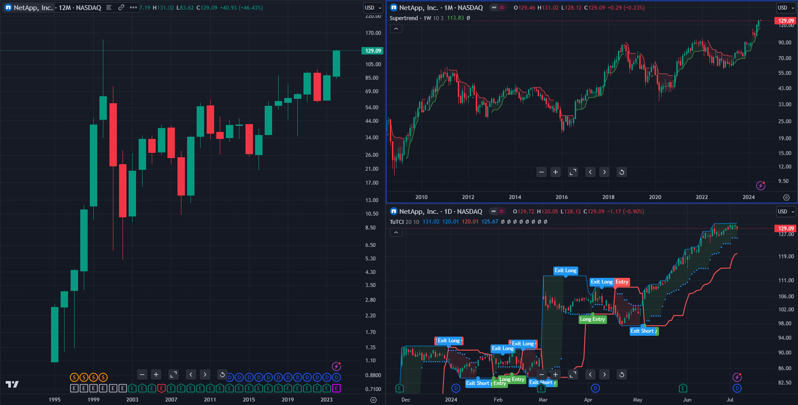

<table class="table">
  <thead>
    <tr>
      <th scope="col">Market</th>
      <th scope="col">Perf All Time > 0%</th>
      <th scope="col">Perf 10Y</th>
      <th scope="col">Perf 5Y</th>
      <th scope="col">Perf YTD</th>
      <th scope="col">Price above 200D SMA</th>
    </tr>
  </thead>
  <tbody>
    <tr>
      <th scope="row">NTAP</th>
      <td>True</td>
      <td>248%</td>
      <td>107%</td>
      <td>48%</td>
      <td>True</td>
    </tr>
  </tbody>
</table>