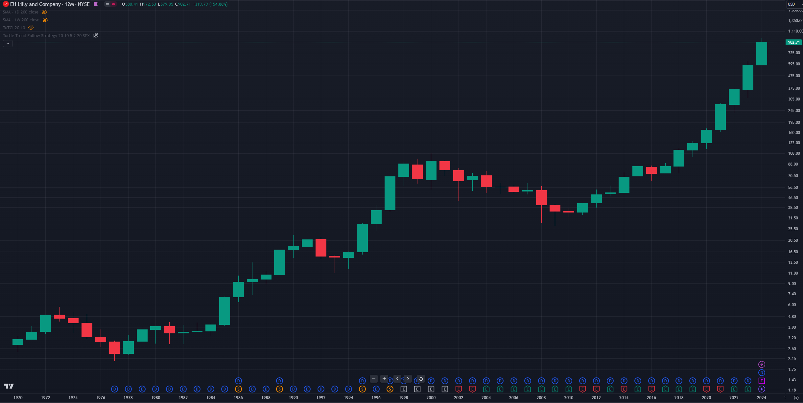
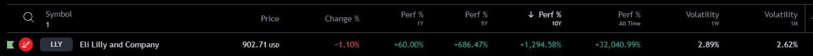
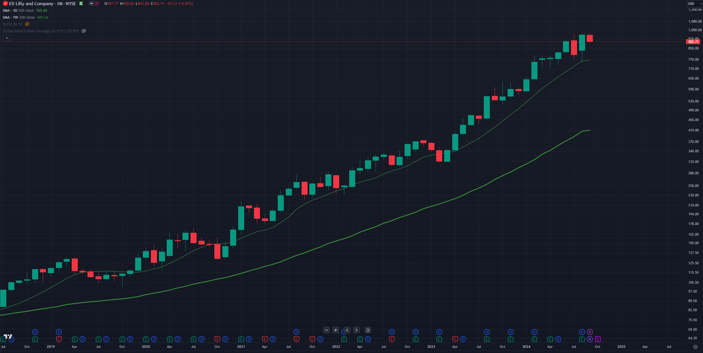
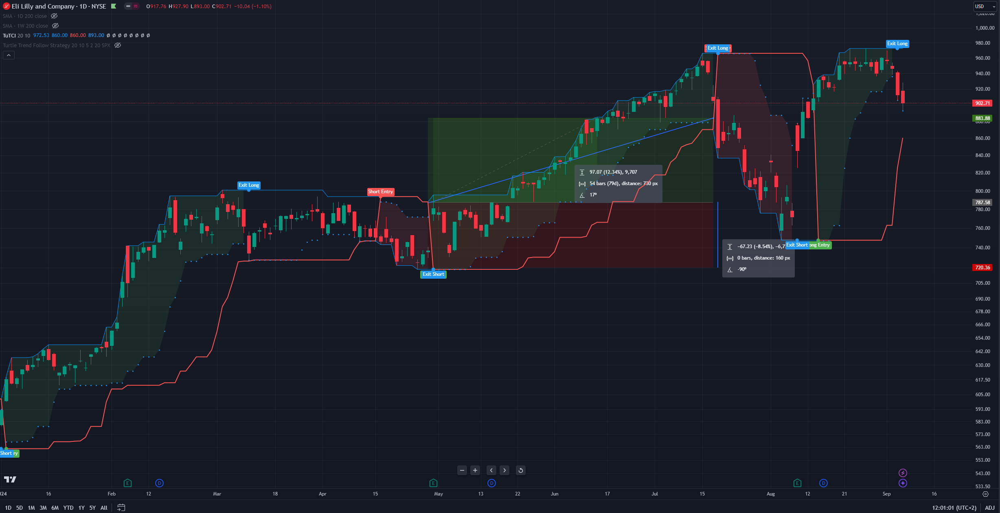
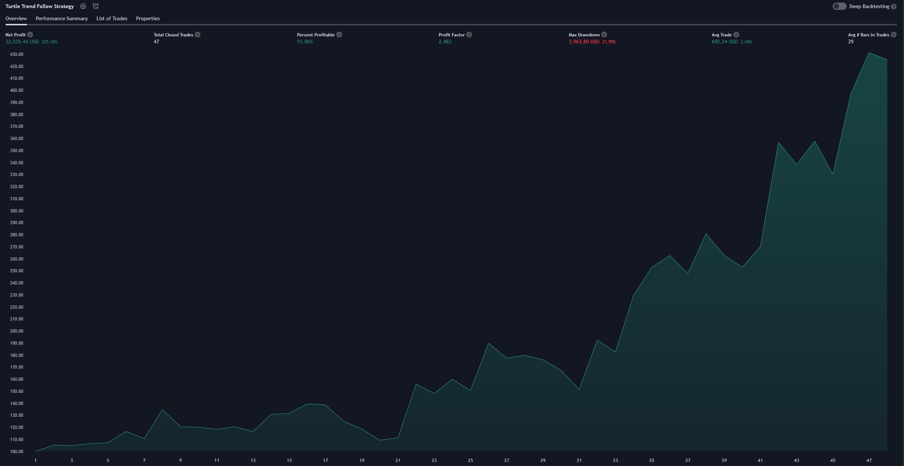
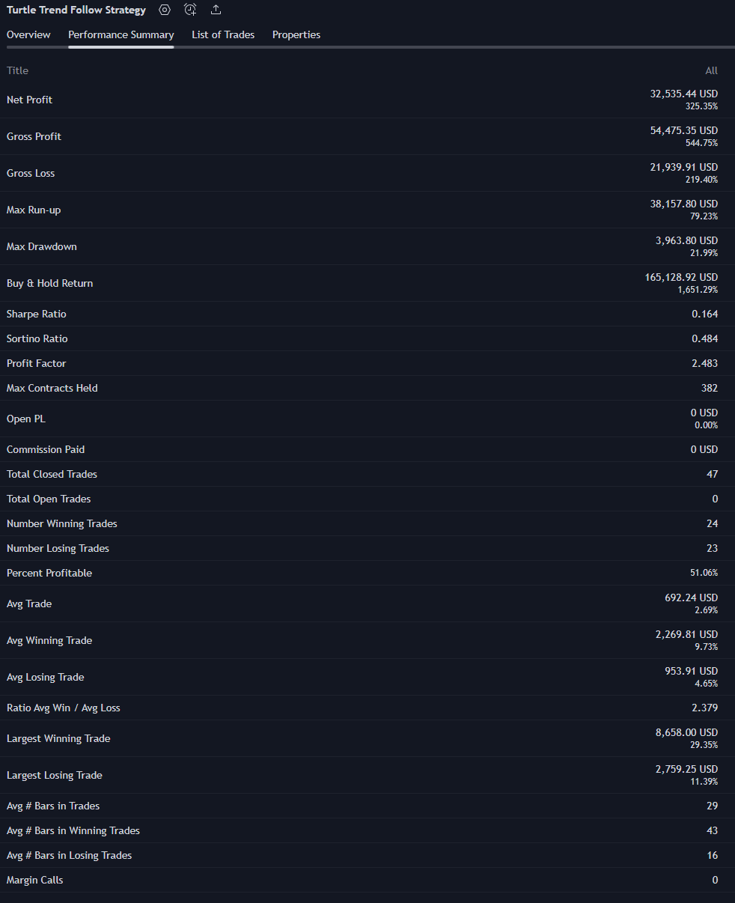

# Eli Lilly & Co.

## Description
Eli Lilly & Co. engages in the discovery, development, manufacture, and sale of pharmaceutical products. The firm's products consist of diabetes, oncology, immunology, neuroscience, and other products and therapies. The company was founded by Eli Lilly in May 1876 and is headquartered in Indianapolis, IN.

## Basic info
* Exchange: NYSE
* Index: S&P 500
* Sector: Healthcare

## Context
```c#
filter = perf all time > 0% + perf 10 years > 100% + perf 5 years > 50% and perf yearly > 10% 
```





## Detail
```c#
trend = price above 200 daily MA + price above 200 weekly MA
```


## Control
**Turtle strategy example**
```c#
entry = breakout 20 daily high
exit = breakout 10 daily low
```



## Backtest
**Turtle strategy**
* <span style="color:green"> Profit: 325%  </span>
* <span style="color:orange"> Max drawdown: 22%  </span>
* Initial capital: 10 000 USD
* Count trades: 47
* Risk per trade: 5%
* Interval: 10 years (1.1.2014 - 7.9.2024)




