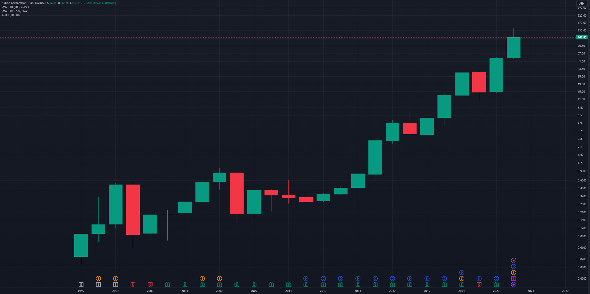
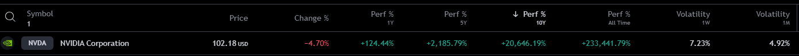
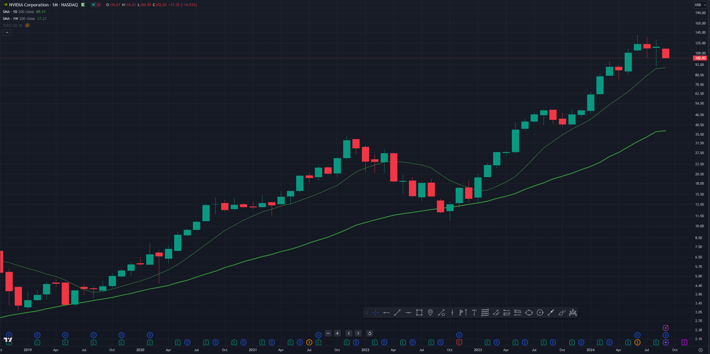
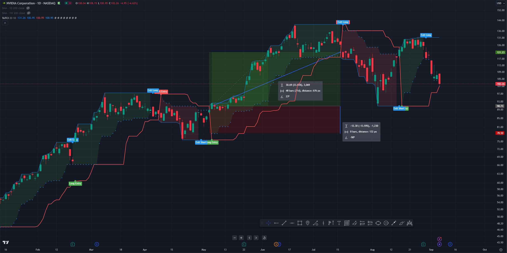
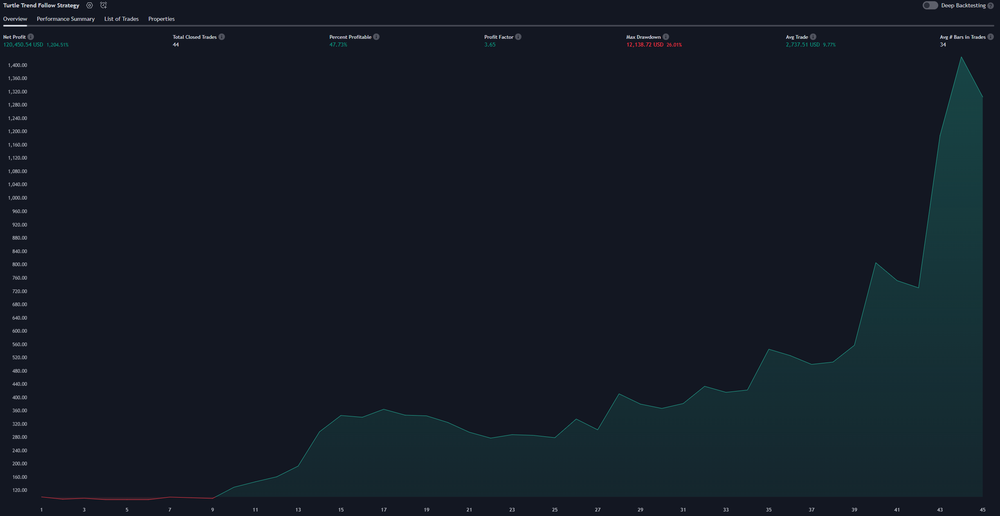
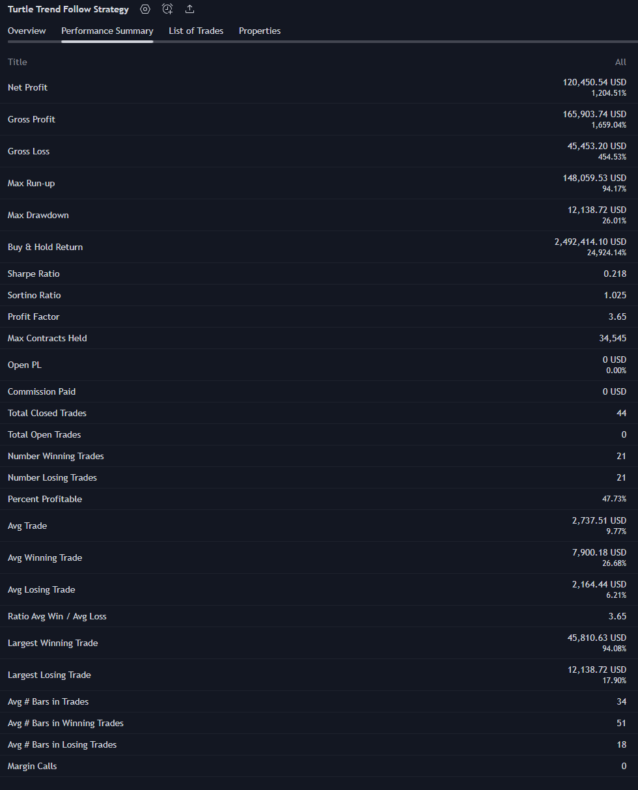

# NVIDIA

## Description
NVIDIA Corp. engages in the design and manufacture of computer graphics processors, chipsets, and related multimedia software. It operates through the following segments: Graphics Processing Unit (GPU) and Compute & Networking. The Graphics segment includes GeForce GPUs for gaming and PCs, the GeForce NOW game streaming service and related infrastructure, Quadro and NVIDIA RTX GPUs for enterprise workstation graphics, virtual GPU, or vGPU, software for cloud-based visual and virtual computing, automotive platforms for infotainment systems, and Omniverse Enterprise software for building and operating metaverse and 3D internet applications. The Compute & Networking segment consists of Data Center accelerated computing platforms and end-to-end networking platforms including Quantum for InfiniBand and Spectrum for Ethernet, NVIDIA DRIVE automated-driving platform and automotive development agreements, Jetson robotics and other embedded platforms, NVIDIA AI Enterprise and other software, and DGX Cloud software and services. The company was founded by Jen Hsun Huang, Chris A. Malachowsky, and Curtis R. Priem in April 1993 and is headquartered in Santa Clara, CA.

## Basic info
* Exchange: NASDAQ 
* Index: NASDAQ100, S&P500
* Sector: Electronic Technology - Semiconductors

## Context
**Context filter**
```c#
filter = perf all time > 0% + perf 10 years > 100% + perf 5 years > 50% and perf yearly > 10% 
```






## Detail
**Trend filter**
```c#
trend = price above 200 daily MA + price above 200 weekly MA
```



## Control
**Turtle strategy example**
```c#
entry = breakout 20 daily high
exit = breakout 10 daily low
```



## Backtest
**Turtle strategy**
* <span style="color:green"> Profit: 1 200%  </span>
* <span style="color:orange"> Max drawdown: 26%  </span>
* Initial capital: 10 000 USD
* Count trades: 44
* Risk per trade: 5%
* Interval: 10 years (1.1.2014 - 6.9.2024)





