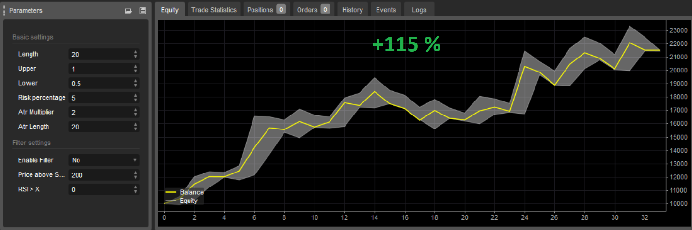
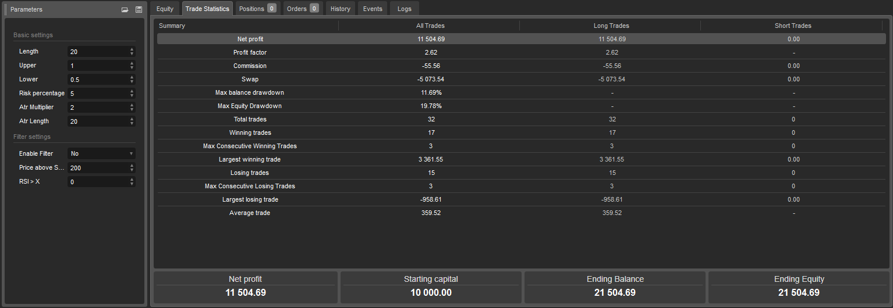

# Bollinger band strategy
The purpose of this strategy is to use the Bollinger Bands to generate trading signals designed to capture powerful breakout price moves and to capitalize on the resulting trends from these breakouts. Strategy developed Australian trader Nick Radge.

**Table of Contents**
* [About strategy](#about-strategy)
* [Author](#author)
* [Entry and exit conditions for long side](#entry-and-exit-conditions-for-long-side)
* [Filters](#filters)
* [Position sizing](#position-sizing)
* [Management of position](#management-of-position)
* [Code example](#code-example)
* [Backtests](#backtests)
* [Suitable markets for trading](#suitable-markets-for-trading)
* [Resources](#resources)

## About strategy
The purpose of this strategy is to use the Bollinger Bands to generate trading signals designed to capture powerful breakout price moves and to capitalize on the resulting trends from these breakouts.

The Bollinger Bands are often used for the purpose of generating signals to determine when price is entering over-sold or over-bought areas on the chart, relative to recent price. This strategy utilizes the Bollinger Bands in a completely different way – to identify breakout trade opportunities which often lead to price trending in a defined direction for an extended period of time.

By definition, all price trends must begin with a breakout from a range. There are many different ways that we can identify and quantify price ranges. As we know, the Bollinger Bands consist of an upper and lower band which are plotted two standard deviations on either side of a 20-period simple moving average (20SMA). For the purposes of this strategy, the range that we are going to use to generate breakout signals is the range between the upper and lower bands of the Bollinger Bands. 

**Prerequisites**
* Liquidity
* Volatility
* Trending market


## Author
Nick Radge is a respected figure in the trading community, renowned for his expertise in systematic trading and trend-following strategies. Hailing from Australia, Radge has made significant contributions to the field of trading through his books, courses, and seminars.

Radge is the author of "Unholy Grails - A New Road to Wealth", where he discusses his approach to trading and the importance of disciplined, rule-based strategies. He emphasizes the need for traders to remain objective and stick to their trading plans, rather than succumbing to emotional impulses.

As the founder of The Chartist, Radge provides trading education and research services to traders seeking to improve their skills and profitability in the financial markets. He is known for his practical and down-to-earth approach, offering insights that can be applied by traders of all levels.

Radge's work centers on trend following and momentum strategies, aiming to capture profits from sustained market movements while managing risk effectively. His dedication to empirical research and systematic methods has earned him a reputation as a trusted mentor and educator in the trading community.

## Entry and exit conditions for long side
**Entry**
* Daily close price is above upper band


**Exit**
* Daily close price is below lower band

```c#
int length = 20
double multiplierUpper = 1
double multiplierLower = 0.5
double upperBand = ta.sma(close, length) + multiplierUpper * ta.stdev(close, length)
double lowerBand = ta.sma(close, length) - multiplierLower * ta.stdev(close, length)
```

## Filters
**Simple**
* Daily close price is above 200 day moving average (bullish environment)

**Advance**

I think using Super trend indicator is more accurate determination of medium-term trend changes from bear market to bull market and vice versa.

* Daily close price is above Super trend indicator(Time frame: Weekly, ATR lenght: 10, Factor: 3)

## Position sizing
The size of the position is determined on the basis of volatility, the more volatile the market, the smaller the positions, and conversely, the less volatile the market, the larger positions are traded so that the risk per trade is always the same in various volatile markets.

**Simple by ATR**
```c#
private double ComputeTradeAmount(){
    int AtrMultiplier = 2;
    double amount = (RiskPerTradeInPercentage * AccountSize) / AtrMultiplier * ATR(20, Days)
    return amount;
}

```

**Advance accurately determine the percentage risk**
```c#
//entryPrice: your entry to market
//stopPrice:  value of lowerband
private double ComputeTradeAmount(double entryPrice, double stopPrice)
{
    double riskPerTrade = (RiskPercentage / 100) * Account.Balance;
        double move = entryPrice - stopPrice;
        double amountRaw = riskPerTrade / ((Math.Abs(move) / Symbol.PipSize) * Symbol.PipValue);
        double amount = ((int)(amountRaw / Symbol.VolumeInUnitsStep)) * Symbol.VolumeInUnitsStep;
        return amount;
}
```

## Management of position
- Only one position open for one market.

## Code example
Example strategy implementation in Python programming language for trading platform QuantConnect.

```python
# region imports
from AlgorithmImports import *
# endregion

class BollingerBandsV1(QCAlgorithm):

    def initialize(self):

        self.length = self.get_parameter("length", 20)
        self.multiplier_upper = self.get_parameter("multiplier_upper", 1)
        self.multiplier_lower = self.get_parameter("multiplier_lower", 0.5)
        self.risk_percentage = self.get_parameter("risk_percentage", 2)
        self.atr_multiplier = self.get_parameter("atr_multiplier", 2)
        self.atr_length = self.get_parameter("atr_lenght", 20)

        self.symbols = self.get_parameter("symbols", "AAPL,MSFT,NVDA").split(",") # BTCUSD,ETHUSD
        self.market_type = self.get_parameter("market_type", "crypto")  # equity, crypto

        # Filter settings
        self.enable_filter = True if (self.get_parameter("enable_filter", "False") == "True") else False

        if self.market_type == "equity":
            self.benchmark_symbol = self.get_parameter("benchmark_symbol", "SPY")
        elif self.market_type == "crypto":
            self.benchmark_symbol = self.get_parameter("benchmark_symbol", "BTCUSD")
            self.set_benchmark(lambda x: self.securities[self.benchmark_symbol].Price)

        # ********************************
        # Algorithm settings
        # ********************************

        # Basic
        self.set_start_date(2015, 1, 1)
        self.set_cash(10000)
        self.enable_automatic_indicator_warm_up = True

        if self.market_type == "equity":
            self.markets = {symbol: self.add_equity(symbol, Resolution.DAILY, leverage=10) for symbol in self.symbols}
            self.add_equity(self.benchmark_symbol, Resolution.DAILY)
        elif self.market_type == "crypto":
            self.markets = {symbol: self.add_crypto(symbol, Resolution.DAILY, leverage=10) for symbol in self.symbols}
            self.add_crypto(self.benchmark_symbol, Resolution.DAILY)

        # Init indicators
        self.bbs_longer = {symbol: self.bb(symbol, self.length, self.multiplier_upper) for symbol in
                            self.symbols}
        self.bbs_shorter = {symbol: self.bb(symbol, self.length, self.multiplier_lower) for symbol in
                             self.symbols}
        self.atrs = {symbol: self.atr(symbol, self.atr_length) for symbol in self.symbols}
        self.benchmark_sma200 = self.sma(self.benchmark_symbol, 200)

    def on_data(self, data: Slice):
        for symbol in self.symbols:
            bb_longer = self.bbs_longer[symbol]
            bb_shorter = self.bbs_shorter[symbol]
            atr = self.atrs[symbol]
            self.strategy(data, symbol, bb_longer, bb_shorter, atr)

    def strategy(self, data, symbol, bb_longer, bb_shorter, atr):
        # **********************************
        # Perform calculations and analysis
        # **********************************

        # Basic
        if symbol not in data.Bars:
            return

        bar = data.Bars[symbol]
        bar_benchmark = data.Bars[self.benchmark_symbol]

        # Trade amount
        quantity = int(((self.risk_percentage / 100) * self.portfolio.cash_book["USD"].amount) / (
                self.atr_multiplier * atr.current.value))

        # Filter
        filter = bar_benchmark.close > self.benchmark_sma200[1].value if self.enable_filter else True

        buy_condition = bar.close > bb_longer.upper_band[1].value and filter and not self.portfolio[symbol].is_long
        sell_condition = bar.close < bb_shorter.lower_band[1].value and self.portfolio[symbol].is_long

        # ********************************
        # Manage trade
        # ********************************
        if buy_condition:
            self.market_order(symbol, quantity)

        if sell_condition:
            self.liquidate(symbol)
```

**All platform source code**
* [TradingView](https://github.com/GeorgeFreelanceDeveloper/trend-follow.io/blob/master/strategies/trend-follow/BollingerBandTrendFollow/scripts/BollingerBandTrendFollowStrategy.pinescript)
* [cTrader](https://github.com/GeorgeFreelanceDeveloper/trend-follow.io/blob/master/strategies/trend-follow/BollingerBandTrendFollow/scripts/BollingerBandTrendFollowStrategy.cs)
* [QuantConnect](https://github.com/GeorgeFreelanceDeveloper/trend-follow.io/blob/master/strategies/trend-follow/BollingerBandTrendFollow/scripts/bollinger_band.py)

## Backtests
**Nasdaq 100 index**
Period: 5 years (2019-2024)





* [All backtests](../../../backtests/)

## Suitable markets for trading
* Cryptocurrencies (Bitcoin, Ethereum)
* Stock indexies (S&P 500, Nasdaq, DJI, NIFTY50)
* Stocks in long-term uptrend (AAPL, MSFT, NVDA, TSLA, AMZN, NFLX, SHOP, MA, ASML, PANW)
* Forex pairs in long-term uptrend (USDTRY, EURTRY, GBPTRY, USDINR, USDCNH) -  <span style="color:red">warning: in reality impossible to trade due to high swap</span>

## Resources
* [nick-radge-the-chartist-a-systematic-trading-expert - zenandtheartoftrading.com](https://zenandtheartoftrading.com/blog/nick-radge-the-chartist-a-systematic-trading-expert/)
* [bollinger-bands-trading-strategy-momentum - aheadofthetrade.com](https://www.aheadofthetrade.com/bollinger-bands-trading-strategy-momentum/)
* [bollinger-band-trading-strategy - bettersystemtrader.com](https://bettersystemtrader.com/bollinger-band-trading-strategy/)
* [nick-radge - bettersystemtrader.com](https://bettersystemtrader.com/004-nick-radge/)
* [Unholy Grails - A New Road to Wealth - book](https://www.amazon.co.uk/dp/B007T97DJQ?tag=bst08-20&geniuslink=true)