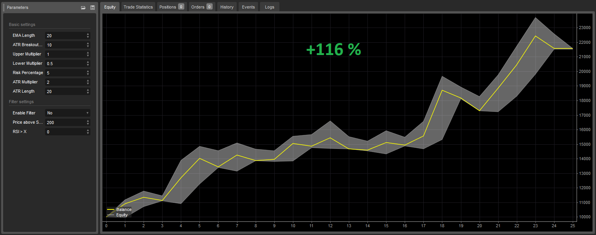

# Keltner channel strategy
The purpose of the Keltner Channel Strategy is to use the Keltner Channels to generate trading signals designed to capture significant breakout price moves and capitalize on the resulting trends from these breakouts. This strategy was originally developed by Chester Keltner in the 1960s and later refined by Linda Bradford Raschke in the 1980s

**Table of Contents**
* [About strategy](#about-strategy)
* [Author](#author)
* [Entry and exit conditions for long side](#entry-and-exit-conditions-for-long-side)
* [Filters](#filters)
* [Position sizing](#position-sizing)
* [Management of position](#management-of-position)
* [Code example](#code-example)
* [Backtests](#backtests)
* [Suitable markets for trading](#suitable-markets-for-trading)
* [Resources](#resources)

## About strategy
The Keltner Channel was first introduced by Chester Keltner in the 1960s. The original formula used simple moving averages (SMA) and the high-low price range to calculate the bands. In the 1980s, a new formula was introduced that used average true range (ATR). The ATR method is commonly used today.

In the 1980s, Linda Bradford Raschke introduced significant updates to the indicator, refining its methodology and making it more adaptable to the financial markets. This updated version, credited with greater accuracy and responsiveness, is embraced by traders worldwide.

The Keltner Channel is a volatility-based technical indicator composed of three separate lines. The middle line is an exponential moving average (EMA) of the price. Additional lines are placed above and below the EMA. The upper band is typically set two times the ATR above the EMA, and the lower band is typically set at the inverse of two times the ATR (below the EMA). The bands expand and contract as volatility (measured by ATR) expands and contracts.

Since most price action will be encompassed within the upper and lower bands (the channel), moves outside the channel can signal trend changes or an acceleration of the trend. The direction of the channel, such as up, down, or sideways, can also aid in identifying the trend direction of the asset. 

**Prerequisites**
* Liquidity
* Volatility
* Trending market


## Author
Chester Keltner is best known for his contribution to technical analysis in the trading industry, particularly through the development of the **Keltner Channel**. The Keltner Channel is a popular technical indicator used by traders to analyze price trends and volatility in financial markets.

Chester Keltner introduced the Keltner Channel in his 1960 book, **"How to Make Money in Commodities."** While the original formulation of the Keltner Channel used the 10-day moving average of the typical price and a fixed percentage for the channel distance, modern interpretations often use the Exponential Moving Average (EMA) and the ATR for more dynamic calculations.

Keltner’s work laid the foundation for this widely-used tool in the trading industry, and his contributions are still highly regarded by traders and technical analysts today.

## Entry and exit conditions for long side
**Entry**
* Daily close price is above upper band

**Exit**
* Daily close price is below lower band

```pinescript
double multiplierUpper = 1
double multiplierLower = 0.5
ema = ta.ema(source =  close, length = emaLength)
rangema = ta.atr(atrBreakoutLength)
upperChannel = ema + rangema * multiplierUpper
lowerChannel = ema - rangema * multiplierLower

buyCondition =  ta.crossover(close, upperChannel)
sellCondition = ta.crossunder(close, lowerChannel) 
```

## Filters
**Simple**
* Daily close price is above 200 day moving average (bullish environment)

**Advance**

I think using Super trend indicator is more accurate determination of medium-term trend changes from bear market to bull market and vice versa.

* Daily close price is above Super trend indicator(Time frame: Weekly, ATR lenght: 10, Factor: 3)

## Position sizing
The size of the position is determined on the basis of volatility, the more volatile the market, the smaller the positions, and conversely, the less volatile the market, the larger positions are traded so that the risk per trade is always the same in various volatile markets.

**Simple by ATR**
```c#
private double ComputeTradeAmount(){
    int AtrMultiplier = 2;
    double amount = (RiskPerTradeInPercentage * AccountSize) / AtrMultiplier * ATR(20, Days)
    return amount;
}
```

**Advance accurately determine the percentage risk**
```c#
//entryPrice: your entry to market
//stopPrice:  value of lowerband
private double ComputeTradeAmount(double entryPrice, double stopPrice)
{
    double riskPerTrade = (RiskPercentage / 100) * Account.Balance;
    double move = entryPrice - stopPrice;
    double amountRaw = riskPerTrade / ((Math.Abs(move) / Symbol.PipSize) * Symbol.PipValue);
    double amount = ((int)(amountRaw / Symbol.VolumeInUnitsStep)) * Symbol.VolumeInUnitsStep;
    return amount;
}
```

## Management of position
- Only one position open for one market.

## Code Example
Example strategy implementation in Python programming language for trading platform QuantConnect.

```python
# region imports
from AlgorithmImports import *
# endregion

class KeltnerChannelV1(QCAlgorithm):

    def initialize(self):

        self.ema_length = self.get_parameter("ema_length", 20)
        self.multiplier_upper = self.get_parameter("multiplier_upper", 1)
        self.multiplier_lower = self.get_parameter("multiplier_lower", 0.5)
        self.risk_percentage = self.get_parameter("risk_percentage", 2)
        self.atr_multiplier = self.get_parameter("atr_multiplier", 2)
        self.atr_length = self.get_parameter("atr_length", 20)

        self.symbols = self.get_parameter("symbols", "AAPL,MSFT,NVDA").split(",")
        self.market_type = self.get_parameter("market_type", "equity")  # equity, crypto

        # Filter settings
        self.enable_filter = True if (self.get_parameter("enable_filter", "False") == "True") else False

        if self.market_type == "equity":
            self.benchmark_symbol = self.get_parameter("benchmark_symbol", "SPY")
        elif self.market_type == "crypto":
            self.benchmark_symbol = self.get_parameter("benchmark_symbol", "BTCUSD")
            self.set_benchmark(lambda x: self.securities[self.benchmark_symbol].Price)

        # ********************************
        # Algorithm settings
        # ********************************

        # Basic
        self.set_start_date(2015, 1, 1)
        self.set_cash(10000)
        self.enable_automatic_indicator_warm_up = True

        if self.market_type == "equity":
            self.markets = {symbol: self.add_equity(symbol, Resolution.DAILY, leverage=10) for symbol in self.symbols}
            self.add_equity(self.benchmark_symbol, Resolution.DAILY)
        elif self.market_type == "crypto":
            self.markets = {symbol: self.add_crypto(symbol, Resolution.DAILY, leverage=10) for symbol in self.symbols}
            self.add_crypto(self.benchmark_symbol, Resolution.DAILY)

        # Init indicators
        self.kchs_longer = {symbol: self.kch(symbol, self.ema_length, self.multiplier_upper) for symbol in
                            self.symbols}
        self.kchs_shorter = {symbol: self.kch(symbol, self.ema_length, self.multiplier_lower) for symbol in
                             self.symbols}
        self.atrs = {symbol: self.atr(symbol, self.atr_length) for symbol in self.symbols}
        self.benchmark_sma200 = self.sma(self.benchmark_symbol, 200)

    def on_data(self, data: Slice):
        for symbol in self.symbols:
            kch_longer = self.kchs_longer[symbol]
            kch_shorter = self.kchs_shorter[symbol]
            atr = self.atrs[symbol]
            self.strategy(data, symbol, kch_longer, kch_shorter, atr)

    def strategy(self, data, symbol, kch_longer, kch_shorter, atr):
        # **********************************
        # Perform calculations and analysis
        # **********************************

        # Basic
        if symbol not in data.Bars:
            return

        bar = data.Bars[symbol]
        bar_benchmark = data.Bars[self.benchmark_symbol]

        # Trade amount
        quantity = int(((self.risk_percentage / 100) * self.portfolio.cash_book["USD"].amount) / (
                self.atr_multiplier * atr.current.value))

        # Filter
        filter = bar_benchmark.close > self.benchmark_sma200[1].value if self.enable_filter else True

        buy_condition = bar.close > kch_longer.upper_band[1].value and filter and not self.portfolio[symbol].is_long
        sell_condition = bar.close < kch_shorter.lower_band[1].value and self.portfolio[symbol].is_long

        # ********************************
        # Manage trade
        # ********************************
        if buy_condition:
            self.market_order(symbol, quantity)

        if sell_condition:
            self.liquidate(symbol)
```

**All platform source code**
* [TradingView](https://github.com/GeorgeFreelanceDeveloper/trend-follow.io/blob/master/strategies/trend-follow/KeltnerChannelTrendFollow/scripts/KeltnerChannelTrendFollowStrategy.pinescript)
* [cTrader](https://github.com/GeorgeFreelanceDeveloper/trend-follow.io/blob/master/strategies/trend-follow/KeltnerChannelTrendFollow/scripts/KeltnerChannelTrendFollowStrategy.cs)
* [QuantConnect](https://github.com/GeorgeFreelanceDeveloper/trend-follow.io/blob/master/strategies/trend-follow/KeltnerChannelTrendFollow/scripts/keltner.py)

## Backtests
**Nasdaq 100 index**
Period: 5 years (2019-2024)




* [All backtests](../../../backtests/)

## Suitable markets for trading
* Cryptocurrencies (Bitcoin, Ethereum)
* Stock indexies (S&P 500, Nasdaq, DJI, NIFTY50)
* Stocks in long-term uptrend (AAPL, MSFT, NVDA, TSLA, AMZN, NFLX, SHOP, MA, ASML, PANW)
* Forex pairs in long-term uptrend (USDTRY, EURTRY, GBPTRY, USDINR, USDCNH) -  <span style="color:red">warning: in reality impossible to trade due to high swap</span>

## Resources
* [keltner-channel - therobusttrader.com](https://therobusttrader.com/keltner-channel/)
* [how-to-day-with-trade-keltner-channels - thebalancemoney.com](https://www.thebalancemoney.com/how-to-day-with-trade-keltner-channels-4051613)
* [keltner-channels - howtotrade.com](https://howtotrade.com/trading-strategies/keltner-channels/)
* [keltnerchannel - investopedia.com](https://www.investopedia.com/terms/k/keltnerchannel.asp)