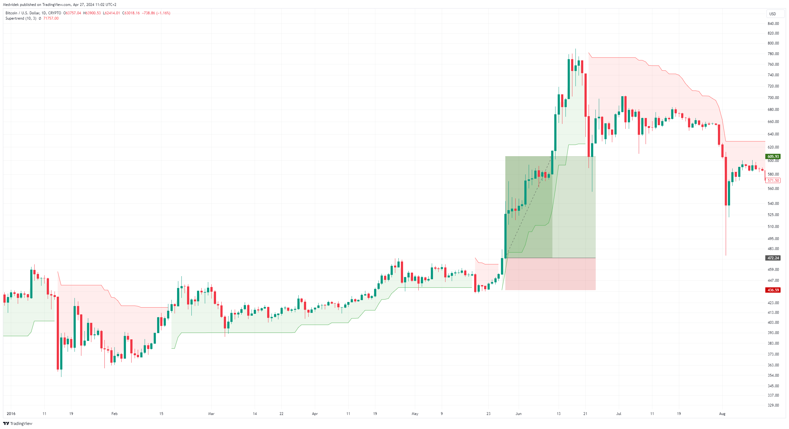

# Supertrend strategy
The Supertrend Strategy is a trend trading strategy developed by Olivier Seban that uses the Supertrend indicator to identify and trade trends in the financial markets. This strategy focuses on entering the market in line with the main trend and exiting the market when the trend begins to reverse.

**Table of Contents**
* [About strategy](#about-strategy)
* [Author](#author)
* [Entry and exit conditions for long side](#entry-and-exit-conditions-for-long-side)
* [Filters](#filters)
* [Position sizing](#position-sizing)
* [Management position](#management-position)
* [Code example](#code-example)
* [Backtests](#backtests)
* [Suitable markets for trading](#suitable-markets-for-trading)
* [Resources](#resources)

## About strategy
The Supertrend Strategy is a trend trading strategy that uses the Supertrend indicator to identify and trade trends in the financial markets. This strategy focuses on entering the market in line with the main trend and exiting the market when the trend begins to reverse.

The basis of the Supertrend strategy is the Supertrend indicator, which determines the direction of the trend and potential entry and exit points. The Supertrend indicator generates signals based on current price data and a certain volatility factor.

In general, when the price crosses the Supertrend up value, it is a signal to buy (long entry), while if the price falls below the Supertrend value, it is a signal to sell (short entry). Traders usually combine Supertrend with other indicators or filters to confirm trading signals and reduce the risk of false signals.

The Supertrend strategy can be used on different time horizons and in different markets, including stocks, forex, commodities and cryptocurrencies.

**Prerequisites**
* Liquidity
* Volatility
* Trending market




## Author
Olivier Seban is a prominent figure in the world of trading and investing, particularly known for his expertise in technical analysis and trend following strategies. Born in France, Seban has built a reputation as an educator and author, sharing his insights and knowledge with aspiring traders worldwide.

Seban is the author of several bestselling books on trading, including "Tout le monde mérite d'être riche" (Everyone Deserves to Be Rich) and "Le pouvoir de l'autodiscipline" (The Power of Self-Discipline). In his works, he emphasizes the importance of discipline, patience, and risk management in achieving long-term success in the financial markets.

As a trader, Seban advocates for a systematic approach to trading, focusing on identifying and riding major market trends while minimizing risk. He is known for his simple yet effective trading techniques that can be applied by traders of all levels of experience.

The SuperTrend indicator was created by Olivier Seban. The SuperTrend indicator is designed to identify trends in financial markets and provide traders with signals for potential entry and exit points based on the direction of those trends. It has become widely used by traders around the world due to its simplicity and effectiveness in capturing trends while minimizing false signals.

## Entry and exit conditions for long side
**Entry**
* Daily close price is above value of  Super trend indicator from previous day

**Exit**
* Daily close price is below value of Super trend indicator from previous day

Super trend indicator parameters: (Time frame: Daily, ATR lenght: 10, Factor: 3)

## Filters
**Simple**
* Daily close price is above 200 day moving average (bullish environment)

**Advance**

I think using Super trend indicator is more accurate determination of medium-term trend changes from bear market to bull market and vice versa.

* Daily close price is above Super trend indicator(Time frame: Weekly, ATR lenght: 10, Factor: 3)

## Position sizing
The size of the position is determined on the basis of volatility, the more volatile the market, the smaller the positions, and conversely, the less volatile the market, the larger positions are traded so that the risk per trade is always the same in various volatile markets.

**Simple by ATR**
```c#
private double ComputeTradeAmount(){
    int AtrMultiplier = 2;
    double amount = (RiskPerTradeInPercentage * AccountSize) / AtrMultiplier * ATR(20, Days)
    return amount;
}

```

**Advance accurately determine the percentage risk**
```c#
//entryPrice: your entry to market
//stopPrice: SuperTrendIdicator value
private double ComputeTradeAmount(double entryPrice, double stopPrice)
{
	double riskPerTrade = (RiskPercentage / 100) * Account.Balance;
        double move = entryPrice - stopPrice;
        double amountRaw = riskPerTrade / ((Math.Abs(move) / Symbol.PipSize) * Symbol.PipValue);
        double amount = ((int)(amountRaw / Symbol.VolumeInUnitsStep)) * Symbol.VolumeInUnitsStep;
        return amount;
}
```

## Management position
- Only one position open for one market.

## Code example

Example strategy implementation in C# programming language for trading platform cTrader.

```c#
using System;
using System.Collections.Generic;
using System.Linq;
using System.Text;
using System.IO;
using cAlgo.API;
using cAlgo.API.Collections;
using cAlgo.API.Indicators;
using cAlgo.API.Internals;

namespace cAlgo.Robots
{
    [Robot(TimeZone = TimeZones.UTC, AccessRights = AccessRights.None)]
    public class SuperTrendFollow_cBot : Robot
    {
        // ********************************
        // User defined inputs
        // ********************************
        
        // Basic settings
        [Parameter("Atr period", Group ="Basic settings", DefaultValue = 10)]
        public int AtrPeriod { get; set; }
        
        [Parameter("Factor", Group ="Basic settings", DefaultValue = 3)]
        public int Factor { get; set; }
        
        [Parameter("Risk percentage", Group ="Basic settings", DefaultValue = 2.5)]
        public double RiskPercentage { get; set; }
        
        [Parameter("Atr Multiplier", Group ="Basic settings", DefaultValue = 2)]
        public int AtrMultiplier {get; set;}
        
        [Parameter("Atr Length", Group ="Basic settings", DefaultValue = 20)]
        public int AtrLength { get; set; }
        
        // Filter settings
        [Parameter("Enable Filter", Group ="Filter settings", DefaultValue =false)]
        public bool EnableFilter {get; set;} 
        
        [Parameter("Price above SMA(X)", Group ="Filter settings", DefaultValue =200)]
        public int SmaLength {get;set;}
        
        [Parameter("RSI > X", Group ="Filter settings", DefaultValue = 0)]
        public int RsiValue {get;set;}
        
        protected override void OnStart()
        {   
        
        }
        
        protected override void OnBarClosed()
        {   
            // **********************************
            // Perform calculations and analysis
            // **********************************

            Supertrend supertrend = Indicators.Supertrend(AtrPeriod, Factor);
            bool isUpTrend = !Double.IsNaN(supertrend.UpTrend.Last());
            
            string label = $"SuperTrendFolow_cBot-{Symbol.Name}";
             
            // Filter
            double lastClosePrice = Bars.ClosePrices.LastValue;
            bool priceAboveSMA = lastClosePrice > Indicators.SimpleMovingAverage(Bars.ClosePrices, SmaLength).Result.LastValue;
            bool rsiAboveValue = Indicators.RelativeStrengthIndex(Bars.ClosePrices, 14).Result.LastValue > RsiValue;
            bool filter = EnableFilter ? priceAboveSMA && rsiAboveValue : true;
            
            // Check position
            Position position = Positions.Find(label);
            bool isOpenPosition = position != null;
            
            // Trade amount
            double qty = ((RiskPercentage/100) * Account.Balance) / (AtrMultiplier * Indicators.AverageTrueRange(AtrLength, MovingAverageType.Simple).Result.LastValue);
            double qtyInLots = ((int)(qty /Symbol.VolumeInUnitsStep)) * Symbol.VolumeInUnitsStep;
            
            bool buyCondition = isUpTrend && !isOpenPosition && filter;
            bool sellCondition = !isUpTrend && isOpenPosition;
            
            // ********************************
            // Manage trade
            // ********************************
            
            // Entry
            if(buyCondition)
            {
                ExecuteMarketOrder(TradeType.Buy, SymbolName, qtyInLots, label);
            }
            
            // Exit
            if(sellCondition) {
                position.Close();
            }

            Print("Sucessful call OnBarClosed() method.");
        }
    }
}
```

**All platform source code**
* [TradingView](https://github.com/GeorgeFreelanceDeveloper/trend-follow.io/blob/master/strategies/trend-follow/SuperTrendFollow/scripts/SuperTrendFollowStrategy.pinescript)
* [cTrader](https://github.com/GeorgeFreelanceDeveloper/trend-follow.io/blob/master/strategies/trend-follow/SuperTrendFollow/scripts/SuperTrendFollowStrategy.cs)
* [Multicharts](https://github.com/GeorgeFreelanceDeveloper/trend-follow.io/blob/master/strategies/trend-follow/SuperTrendFollow/scripts/SuperTrendFollowStrategy.easylanguage)
* [TradeStation](https://github.com/GeorgeFreelanceDeveloper/trend-follow.io/blob/master/strategies/trend-follow/SuperTrendFollow/scripts/SuperTrendFollowStrategy.easylanguage)

## Backtests
**Nasdaq 100 index**
Period: 5 years (2019-2024)


* [All backtests](../../../backtests/)

## Suitable markets for trading
* Cryptocurrencies (Bitcoin, Ethereum)
* Stock indexies (S&P 500, Nasdaq, DJI, NIFTY50)
* Stocks in long-term uptrend (AAPL, MSFT, NVDA, TSLA, AMZN, NFLX, SHOP, MA, ASML, PANW)
* Forex pairs in long-term uptrend (USDTRY, EURTRY, GBPTRY, USDINR, USDCNH) - <span style="color:red">warning: in reality impossible to trade due to high swap</span>

## Resources
* [Supertrend Indicator: What It Is, How It Works - investopedia.com](https://www.investopedia.com/supertrend-indicator-7976167)
* [SuperTrend Indicator: A Comprehensive Guide - trendspider.com](https://trendspider.com/learning-center/supertrend-indicator-a-comprehensive-guide/)
* [Supertrend Indicator: Trading Strategy and Best Settings - howtotrade.com](https://howtotrade.com/indicators/supertrend/)