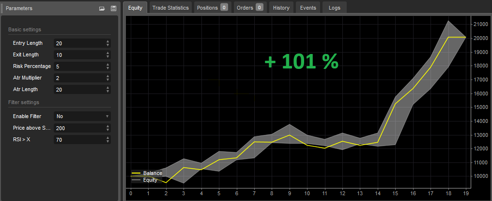
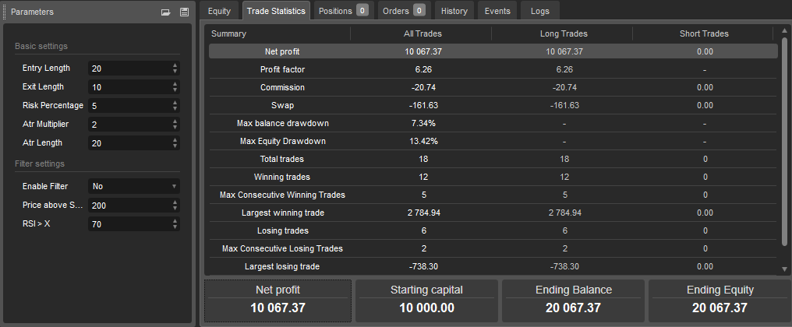

# Turtle strategy
The Turtle Trading strategy is a famous trend-following approach developed by legendary commodity traders Richard Dennis and William Eckhardt in the early 1980s.
The strategy involves buying a stock or contract during a breakout (when prices move above a trading range) and quickly selling on a retracement or price fall.

**Table of Contents**
* [About strategy](#about-strategy)
* [Author](#author)
* [Entry and exit conditions for long side](#entry-and-exit-conditions-for-long-side)
* [Filters](#filters)
* [Position sizing](#position-sizing)
* [Management of position](#management-of-position)
* [Code example](#code-example)
* [Backtests](#backtests)
* [Suitable markets for trading](#suitable-markets-for-trading)
* [Resources](#resources)

## About strategy
The Turtle Trading strategy was developed by Richard Dennis and William Eckhardt in the early 1980s. Story
relates that Richard Dennis, a successful commodity trader, believed that trading could be taught to anyone and decided to conduct an experiment to confirm his theory. He created a group of people known as the "Turtles" and taught them his trade system.

The basic principle of the Turtle Trading strategy is to follow the trend. The goal is to identify and trade strong trends on financial markets. Turtles learned to buy and hold futures contracts for markets that were in a strong uptrend and sell short and hold contracts for markets in a strong downtrend. Personally, I think it's better focus on markets in a long-term up-trend and trade only on the long side.

> "Turtle trading trading system is simple to learn but to work properly
it requires a trending market, confidence in the system, consistency and discipline." Richard Dennis

**Prerequisites**
* Liquidity
* Volatility
* Trending market


## Author
Richard Dennis, a legendary figure in the world of trading, rose to prominence in the 1980s with his innovative trading strategies. Born in 1949, Dennis started his career as a commodities trader in Chicago. He gained widespread recognition for his role in the Turtle Trading Experiment, where he famously recruited and trained a group of novice traders, teaching them his proprietary trading techniques.

Dennis' trading philosophy emphasized the importance of following systematic rules rather than relying on emotions or intuition. He believed that successful trading could be taught, regardless of one's background or experience. This belief was exemplified in the Turtle experiment, where his students, dubbed the "Turtle Traders," achieved remarkable success.

Richard Dennis's legacy endures as a testament to the power of disciplined trading strategies and the potential for individuals to achieve success in the financial markets with the right guidance and methodology.

## Entry and exit conditions for long side
**Entry**
* Daily close price is above max 20 days high price

**Exit**
* Daily close price is below min 10 days low price

## Filters
**Simple**
* Daily close price is above 200 day moving average (bullish environment)

**Advance**

I think using Super trend indicator is more accurate determination of medium-term trend changes from bear market to bull market and vice versa.

* Daily close price is above Super trend indicator(Time frame: Weekly, ATR lenght: 10, Factor: 3)

## Position sizing
The size of the position is determined on the basis of volatility, the more volatile the market, the smaller the positions, and conversely, the less volatile the market, the larger positions are traded so that the risk per trade is always the same in various volatile markets.

**Simple by ATR**
```c#
private double ComputeTradeAmount(){
    int AtrMultiplier = 2;
    double amount = (RiskPerTradeInPercentage * AccountSize) / AtrMultiplier * ATR(20, Days)
    return amount;
}

```

**Advance accurately determine the percentage risk**
```c#
private double ComputeTradeAmount(double entryPrice, double stopPrice)
{
    double riskPerTrade = (RiskPercentage / 100) * Account.Balance;
        double move = entryPrice - stopPrice;
        double amountRaw = riskPerTrade / ((Math.Abs(move) / Symbol.PipSize) * Symbol.PipValue);
        double amount = ((int)(amountRaw / Symbol.VolumeInUnitsStep)) * Symbol.VolumeInUnitsStep;
        return amount;
}
```

## Management of position
- Only one position open for one market.

## Code example

Example strategy implementation in Python programming language for trading platform QuantConnect.

```python
# region imports
from AlgorithmImports import *
# endregion

class TurtleV1(QCAlgorithm):

    def initialize(self):

        # ********************************
        # User defined inputs
        # ********************************

        # Basic settings
        self.entry_length = self.get_parameter("entry_length", 20)
        self.exit_length = self.get_parameter("exit_length", 10)
        self.risk_percentage = self.get_parameter("risk_percentage", 2)
        self.atr_multiplier = self.get_parameter("atr_multiplier", 2)
        self.atr_length = self.get_parameter("atr_lenght", 20)

        # Top stocks for turtle in period 2015-2025: AAPL,NVDA,MSFT,AMZN,META,TSLA,AVGO,LLY,COST,HD
        # Top crypto for turtle in period 2015-2025: BTCUSD, ETHUSD
        self.symbols = self.get_parameter("symbols", "AAPL,MSFT,NVDA").split(",")
        self.market_type = self.get_parameter("market_type", "equity")  # equity, crypto

        # Filter settings
        self.enable_filter = True if (self.get_parameter("enable_filter", "False") == "True") else False

        if self.market_type == "equity":
            self.benchmark_symbol = self.get_parameter("benchmark_symbol", "SPY")
        elif self.market_type == "crypto":
            self.benchmark_symbol = self.get_parameter("benchmark_symbol", "BTCUSD")
            self.set_benchmark(lambda x: self.securities[self.benchmark_symbol].Price)

        # ********************************
        # Algorithm settings
        # ********************************

        # Basic
        self.set_start_date(2015, 1, 1)
        # self.set_end_date(2025,2,4)
        self.set_cash(10000)
        self.enable_automatic_indicator_warm_up = True

        if self.market_type == "equity":
            self.markets = {symbol: self.add_equity(symbol, Resolution.DAILY, leverage=10) for symbol in self.symbols}
            self.add_equity(self.benchmark_symbol, Resolution.DAILY)
        elif self.market_type == "crypto":
            self.markets = {symbol: self.add_crypto(symbol, Resolution.DAILY, leverage=10) for symbol in self.symbols}
            self.add_crypto(self.benchmark_symbol, Resolution.DAILY)

        # Init indicators
        self.dchs = {symbol: self.dch(symbol, self.entry_length, self.exit_length) for symbol in self.symbols}
        self.atrs = {symbol: self.atr(symbol, self.atr_length) for symbol in self.symbols}
        self.benchmark_sma200 = self.sma(self.benchmark_symbol, 200)

    def on_data(self, data: Slice):
        for symbol in self.symbols:
            dch = self.dchs[symbol]
            atr = self.atrs[symbol]
            self.strategy(data, symbol, dch, atr)

    def strategy(self, data, symbol, dch, atr):
        # **********************************
        # Perform calculations and analysis
        # **********************************

        # Basic
        if symbol not in data.Bars:
            return

        bar = data.Bars[symbol]
        bar_benchmark = data.Bars[self.benchmark_symbol]

        # Trade amount
        quantity = int(((self.risk_percentage / 100) * self.portfolio.cash_book["USD"].amount) / (
                    self.atr_multiplier * atr.current.value))

        # Filter
        filter = bar_benchmark.close > self.benchmark_sma200[1].value if self.enable_filter else True

        buy_condition = bar.close > dch.upper_band[1].value and filter and not self.portfolio[symbol].is_long
        sell_condition = bar.close < dch.lower_band[1].value

        # ********************************
        # Draw outputs
        # ********************************

        # Plot indicator and prices
        # self.Plot("Custom", "Donchian Channel High", self.dch.upper_band[1].value)
        # self.Plot("Custom", "High Price", bar.high)
        # self.Plot("Custom", "Close Price", bar.close)
        # self.Plot("Custom", "Low Price", bar.low)
        # self.Plot("Custom", "Donchian Channel Low", self.dch.lower_band[1].value)

        # ********************************
        # Manage trade
        # ********************************
        if buy_condition:
            self.market_order(symbol, quantity)

        if sell_condition:
            self.liquidate(symbol)

```

**All platform source code**
* [TradingView](https://github.com/GeorgeFreelanceDeveloper/trend-follow.io/blob/master/strategies/trend-follow/TurtleTrendFollow/scripts/TurtleTrendFollowStrategy.pinescript)
* [cTrader](https://github.com/GeorgeFreelanceDeveloper/trend-follow.io/blob/master/strategies/trend-follow/TurtleTrendFollow/scripts/TurtleTrendFollowStrategy.cs)
* [QuantConnect](https://github.com/GeorgeFreelanceDeveloper/trend-follow.io/blob/master/strategies/trend-follow/TurtleTrendFollow/scripts/turtle.py)

## Backtests
**Nasdaq 100 index**
Period: 5 years (2019-2024)





* [All backtests](../../../backtests/)


## Suitable markets for trading
* Cryptocurrencies (Bitcoin, Ethereum)
* Stock indexies (S&P 500, Nasdaq, DJI, NIFTY50)
* Stocks in long-term uptrend (AAPL, MSFT, NVDA, TSLA, AMZN, NFLX, SHOP, MA, ASML, PANW)
* Forex pairs in long-term uptrend (USDTRY, EURTRY, GBPTRY, USDINR, USDCNH) - <span style="color:red">warning: in reality impossible to trade due to high swap</span>

## Resources
* [Kryptoměny – Jak je obchodovat systematicky a vydělávat na růstu i propadu?](https://www.financnik.cz/clanky/obchodni-strategie/kryptomeny-systematicky/#trendove-obchodovani-kryptomen)
* [Jak na Trend Following (trendové obchodování)](https://www.financnik.cz/clanky/obchodni-strategie/trend-following/)
* [Turtle Trading Tutorial](https://www.asktraders.com/learn-to-trade/trading-strategies/turtle-trading-tutorial/)
* [Turtle Trading: History, Strategy & Complete Rules - Analyzing Alpha](https://analyzingalpha.com/turtle-trading)
* [Turtle Trading: A Market Legend](https://www.investopedia.com/articles/trading/08/turtle-trading.asp)
* [TURTLE TRADING - STRATEGY EXPLAINED](https://www.tradingview.com/chart/EURUSD/72x1YqG6-TURTLE-TRADING-STRATEGY-EXPLAINED/)
* [Donchian Channels Formula, Calculations, and Uses](https://www.investopedia.com/terms/d/donchianchannels.asp)
* [Legendy tradingu (3. díl): Experimentátor, který změnil pohled na obchodování](https://www.purple-trading.com/cs/legendy-tradingu-richard-dennis/)
* [Turtles Trading Strategy Explained - COMPREHENSIVE](https://www.youtube.com/watch?v=eotKvzrJVQk)
* [TURTLE TRADERS STRATEGY - The Complete TurtleTrader by Michael Covel. (Richard Dennis)](https://www.youtube.com/watch?v=NJkXSZUHl1g)


