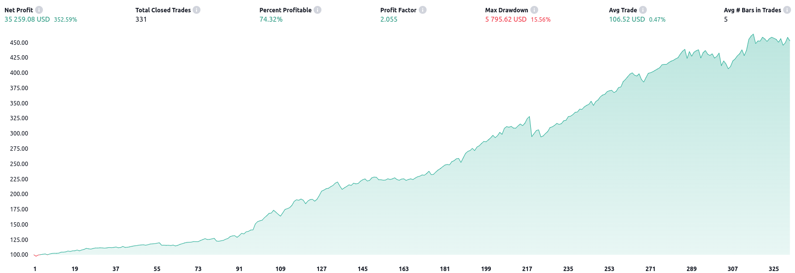

# MeanReversalPortfolio backtest

## Markets
* **SPX**: The S&P 500 Index, also known as the Standard & Poor’s 500 Index, is a market-capitalization-weighted index that tracks the performance of approximately 500 leading publicly traded companies in the United States. 

## Interval
- 30+ years
- 1.1.1990 - 4.5.2024

## Strategy 1
**Inputs**
- Basic settings
    - Enable strategy 1: True
    - Enable strategy 2: False
    - Enable strategy 3: False
    - Enable strategy 4: False
    - Enable strategy 5: False

- Filter settings
    - Enable filter: True
    - Benchmark: SPX

- Time settings
    - From date: 1.1.1990
    - To date: 4.5.2024

- Properties
    - Initial capital: 10 000 USD
    - Order size: 100% equity
    - Pyramiding: 0

**Outputs**
- Net profit: 289% (CAGR 8.5%)
- Total count trades: 275 (avg 8 trades per year) 
- Percentage profitability: 73.82%
- Profit factor: 2.09
- Ratio Avg Win / Avg Loss: 0.74
- Max drawdown: 15.53%

**Equity**

**Drawdown**

## Strategy 2
**Inputs**
- Basic settings
    - Enable strategy 1: False
    - Enable strategy 2: True
    - Enable strategy 3: False
    - Enable strategy 4: False
    - Enable strategy 5: False

- Filter settings
    - Enable filter: True
    - Benchmark: SPX

- Time settings
    - From date: 1.1.1990
    - To date: 5.5.2024

- Properties
    - Initial capital: 10 000 USD
    - Order size: 100% equity
    - Pyramiding: 0

**Outputs**
- Net profit: 156.29% (CAGR 4.59%)
- Total count trades: 202 (avg 5-6 trades per year) 
- Percentage profitability: 77.23%
- Profit factor: 2.56
- Ratio Avg Win / Avg Loss: 0.755
- Max drawdown: 14.55%

**Equity**

**Drawdown**

## Strategy 3
**Inputs**
- Basic settings
    - Enable strategy 1: False
    - Enable strategy 2: False
    - Enable strategy 3: True
    - Enable strategy 4: False
    - Enable strategy 5: False

- Filter settings
    - Enable filter: True
    - Benchmark: SPX

- Time settings
    - From date: 1.1.1990
    - To date: 5.5.2024

- Properties
    - Initial capital: 10 000 USD
    - Order size: 100% equity
    - Pyramiding: 0

**Outputs**
- Net profit: 352.59% (CAGR 10.37%)
- Total count trades: 331 (avg 9-10 trades per year) 
- Percentage profitability: 74.32%
- Profit factor: 2.055
- Ratio Avg Win / Avg Loss: 0.71
- Max drawdown: 15.56%

**Equity**

**Drawdown**

## Strategy 4
**Inputs**
- Basic settings
    - Enable strategy 1: False
    - Enable strategy 2: False
    - Enable strategy 3: False
    - Enable strategy 4: True
    - Enable strategy 5: False

- Filter settings
    - Enable filter: True
    - Benchmark: SPX

- Time settings
    - From date: 1.1.1990
    - To date: 5.5.2024

- Properties
    - Initial capital: 10 000 USD
    - Order size: 100% equity
    - Pyramiding: 0

**Outputs**
- Net profit: 288.49% (CAGR 10.37%)
- Total count trades: 331 (avg 8-9 trades per year) 
- Percentage profitability: 74.04%
- Profit factor: 1.502
- Ratio Avg Win / Avg Loss: 0.521
- Max drawdown: 19.08%

**Equity**

**Drawdown**

## Strategy 5
**Inputs**
- Basic settings
    - Enable strategy 1: False
    - Enable strategy 2: False
    - Enable strategy 3: False
    - Enable strategy 4: False
    - Enable strategy 5: True

- Filter settings
    - Enable filter: True
    - Benchmark: SPX

- Time settings
    - From date: 1.1.1990
    - To date: 5.5.2024

- Properties
    - Initial capital: 10 000 USD
    - Order size: 100% equity
    - Pyramiding: 0

**Outputs**
- Net profit: 82.82% (CAGR 2.43%)
- Total count trades: 153 (avg 4-5 trades per year) 
- Percentage profitability: 72.55%
- Profit factor: 2.725
- Ratio Avg Win / Avg Loss: 1.006
- Max drawdown: 8.14%

**Equity**

**Drawdown**

## All strategies
**Inputs**
- Basic settings
    - Enable strategy 1: True
    - Enable strategy 2: True
    - Enable strategy 3: True
    - Enable strategy 4: True
    - Enable strategy 5: True

- Filter settings
    - Enable filter: True
    - Benchmark: SPX

- Time settings
    - From date: 1.1.1990
    - To date: 5.5.2024

- Properties
    - Initial capital: 10 000 USD
    - Order size: 100% equity
    - Pyramiding: 0

**Outputs**
- Net profit: 641.71% (CAGR 18.87%)
- Total count trades: 966 (avg 28-29 trades per year) 
- Percentage profitability: 73.29%
- Profit factor: 1.518
- Ratio Avg Win / Avg Loss: 0.549
- Max drawdown: 18.21%

**Equity**

**Drawdown**
