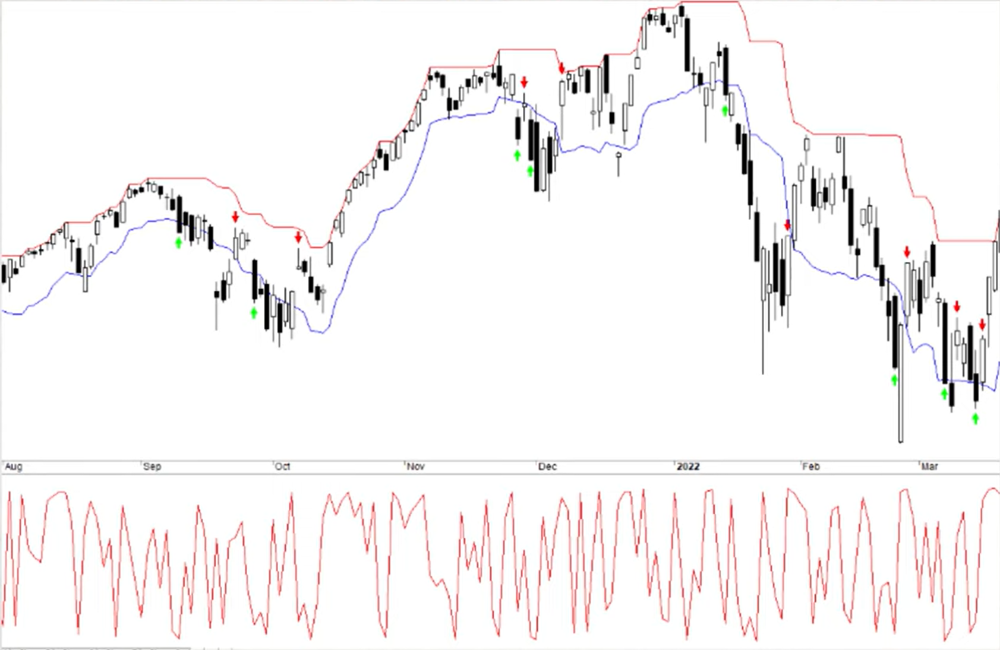

# Mean reversal portfolio

## About strategy
In this project, we unveil 5 powerful and proven swing trading strategies for the stock market that you can start using yourself to turn a profit. All 5 systems have been backtested over a period of 30 years on the S&P 500, and we will show you the exact trading rules we applied. You'll also learn how to combine all five strats into one portfolio of swing trading strategies.

The first swing trading strategy involves entering when the price has dropped from a recent high and selling on strength. The second strategy is known as Turnaround Tuesday and involves buying at the close on Monday if the close is lower for the second day in a row. The third swing trading strategy is a simple mean reversion strategy that involves buying when the close is lower than the low of the previous 5 trading days. The fourth trading strategy is based on volatility and involves buying when today's range is lower than the daily range of the previous 6 trading days and the close is above the 200-day moving average. The fifth and final swing trading strategy involves buying on a weak day when the price has set a new ten-day high earlier in the trading session.

All five swing trading strategies are backtested and have produced impressive returns over the years. But when combined, they have produced even better results with only three losing years since 1993. The combined trading systems have returned an average of 0.38% per trade, resulting in a compounding return of 14.1% with max drawdown around 25% (index has drawdown above 50%).

**Prerequisites**
* Liquidity
* Volatility
* Trending market

## Authors
Portfolio strategies was develop Oddmund Groette and Hakan Samuelsson and their team. Mr. Groette is a native Norwegian but resides in Latvia. Mr. Samuelsson lives in Sweden, where he trades, invests, and also manages one of Sweden’s most popular financial websites. They have been independent full-time traders and investors for +20 years.

**Oddmund Groette**

* 1990-94: Norwegian School of Management (BI): Master degree – Business Administration.
* 1994-95: Mandatory military service.
* 1995-96: Heriot-Watt University: MSc Banking And International Finance.
* 1996-1998: Auditor
* 1998-2001: Co-founded Aksjeform.com, one of Norway’s first websites about trading and investing. Acquired by Digi.no in 2000.
* 2001-2018: Full-time independent and 100% systematic trader and investor. Passed Series 7 in 2001, but the license has since lapsed.
* 2018-today: Investor, writer, analyst.

**Håkan Samuelsson**

* Samuelsson has a Master’s Degree in Engineering from the Royal Institute of Technology in Stockholm.
* He found a passion for trading early in his life and has been trading for many years as a proprietary trader and retail.
* He loves traveling and has lived and worked in 10 countries around the globe.
* Today he works as an investor and runs a few companies as an entrepreneur.

## Entry and exit conditions

-- Strategy 1

**Entry**
* Calculate an average of the High minus Low over tha last 25 days
* Calculate the (C-L)/(H-L) ravio every day (IBS indicator)
* Calculate a band 2.5 times lower than tthe high over the last 10 days by using average from point number 1
* If SPY closes under the band in number 3, and point 2 has a lower value than 0.3 (IBS), then go long at the close 

**Exit**
* When daily close is higher than yesterday high

-- Strategy 2

**Entry**
* Today is Monday
* Today close must be lower then Friday
* Friday close was lower than Thursday

**Exit**
* When daily close is higher than yesterday high

-- Strategy 3

**Entry**
* We buy when the close is lower than the low of previous 5 trading days

**Exit**
* When daily close is higher than yesterday high

-- Strategy 4

**Entry**
* If today has the lowest range (High minus Low) of the previous last 6 trading days, then we go long at the close
* The close must be above the 200-day moving average

**Exit**
* When daily close is higher than yesterday high

-- Strategy 5

**Entry**
* Today high must be higher than the previous high of the last ten days
* Todays IBS indicator ( (C-L)/(H-L) ) must be below 0.15

**Exit**
* When daily close is higher than yesterday high

## Filters
**Simple**
* Daily close price is above 200 day moving average (bullish environment)

**Advance**

Using Super trend indicator is more accurate determination of medium-term trend changes from bear market to bull market and vice versa.

* Daily close price is above Super trend indicator(Time frame: Weekly, ATR lenght: 10, Factor: 3)

## Position sizing
- Invest all account balance to position.

## Management position
- Only one position is open.

## Suitable markets for trading
* Strategy is build for S&P500 index. The strategy should also work on other stock indexes that are long-term growth probably.

## Notes

## Resources
* [mean-reversion-trading-strategy - quantifiedstrategies.com](https://www.quantifiedstrategies.com/mean-reversion-trading-strategy/)
* [5 Swing Trading Strategies 2024 (Backtest And Settings)](https://www.youtube.com/watch?v=kWgUlIFAwqg)
