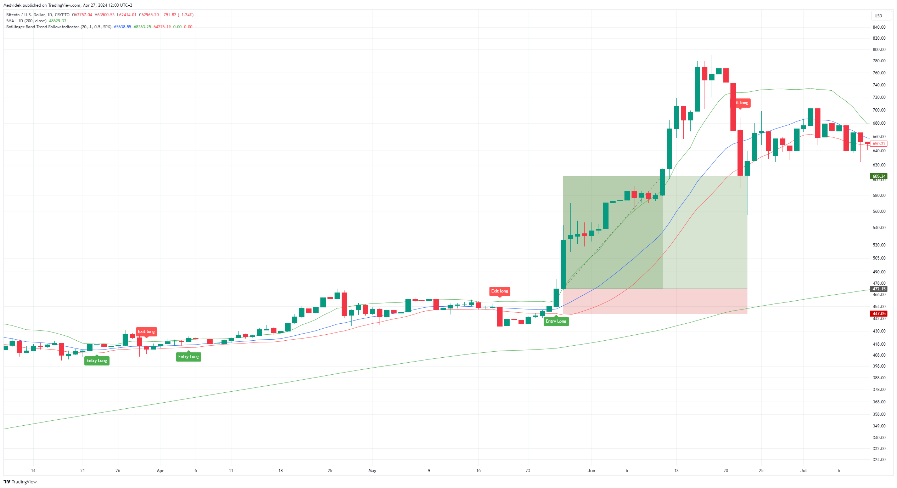

# BollingerBandTrendFollow

## About strategy
The purpose of this strategy is to use the Bollinger Bands to generate trading signals designed to capture powerful breakout price moves and to capitalize on the resulting trends from these breakouts.

The Bollinger Bands are often used for the purpose of generating signals to determine when price is entering over-sold or over-bought areas on the chart, relative to recent price. This strategy utilizes the Bollinger Bands in a completely different way – to identify breakout trade opportunities which often lead to price trending in a defined direction for an extended period of time.

By definition, all price trends must begin with a breakout from a range. There are many different ways that we can identify and quantify price ranges. As we know, the Bollinger Bands consist of an upper and lower band which are plotted two standard deviations on either side of a 20-period simple moving average (20SMA). For the purposes of this strategy, the range that we are going to use to generate breakout signals is the range between the upper and lower bands of the Bollinger Bands. 

**Prerequisites**
* Liquidity
* Volatility
* Trending market



## Author
Nick Radge is a respected figure in the trading community, renowned for his expertise in systematic trading and trend-following strategies. Hailing from Australia, Radge has made significant contributions to the field of trading through his books, courses, and seminars.

Radge is the author of "Unholy Grails - A New Road to Wealth", where he discusses his approach to trading and the importance of disciplined, rule-based strategies. He emphasizes the need for traders to remain objective and stick to their trading plans, rather than succumbing to emotional impulses.

As the founder of The Chartist, Radge provides trading education and research services to traders seeking to improve their skills and profitability in the financial markets. He is known for his practical and down-to-earth approach, offering insights that can be applied by traders of all levels.

Radge's work centers on trend following and momentum strategies, aiming to capture profits from sustained market movements while managing risk effectively. His dedication to empirical research and systematic methods has earned him a reputation as a trusted mentor and educator in the trading community.

## Entry and exit conditions
**Entry**
* Daily close price is above upper band


**Exit**
* Daily close price is below lower band

```c#
int length = 20
double multiplierUpper = 1
double multiplierLower = 0.5
double upperBand = ta.sma(close, length) + multiplierUpper * ta.stdev(close, length)
double lowerBand = ta.sma(close, length) - multiplierLower * ta.stdev(close, length)
```

## Filters
**Simple**
* Daily close price is above 200 day moving average (bullish environment)

**Advance**

Using Super trend indicator is more accurate determination of medium-term trend changes from bear market to bull market and vice versa.

* Daily close price is above Super trend indicator(Time frame: Weekly, ATR lenght: 10, Factor: 3)

## Position sizing
The size of the position is determined on the basis of volatility, the more volatile the market, the smaller the positions, and conversely, the less volatile the market, the larger positions are traded so that the risk per trade is always the same in various volatile markets.

**Simple by ATR**
```c#
private double ComputeTradeAmount(){
    int AtrMultiplier = 2;
    double amount = (RiskPerTradeInPercentage * AccountSize) / AtrMultiplier * ATR(20, Days)
    return amount;
}

```

**Advance accurately determine the percentage risk**
```c#
//entryPrice: your entry to market
//stopPrice:  value of lowerband
private double ComputeTradeAmount(double entryPrice, double stopPrice)
{
	double riskPerTrade = (RiskPercentage / 100) * Account.Balance;
        double move = entryPrice - stopPrice;
        double amountRaw = riskPerTrade / ((Math.Abs(move) / Symbol.PipSize) * Symbol.PipValue);
        double amount = ((int)(amountRaw / Symbol.VolumeInUnitsStep)) * Symbol.VolumeInUnitsStep;
        return amount;
}
```

## Management position
- Only one position open for one market.

## Suitable markets for trading
* Cryptocurrencies (Bitcoin, Ethereum)
* Stock indexies (S&P 500, Nasdaq, DJI, NIFTY50)
* Stocks in long-term uptrend (AAPL, MSFT, NVDA, TSLA, AMZN, NFLX, SHOP, MA, ASML, PANW)
* Forex pairs in long-term uptrend (USDTRY, EURTRY, GBPTRY, USDINR, USDCNH) -  warning: in reality impossible to trade due to high swap

## Notes

## Resources
* [nick-radge-the-chartist-a-systematic-trading-expert - zenandtheartoftrading.com](https://zenandtheartoftrading.com/blog/nick-radge-the-chartist-a-systematic-trading-expert/)
* [bollinger-bands-trading-strategy-momentum - aheadofthetrade.com](https://www.aheadofthetrade.com/bollinger-bands-trading-strategy-momentum/)
* [bollinger-band-trading-strategy - bettersystemtrader.com](https://bettersystemtrader.com/bollinger-band-trading-strategy/)
* [nick-radge - bettersystemtrader.com](https://bettersystemtrader.com/004-nick-radge/)
* [Unholy Grails - A New Road to Wealth - book](https://www.amazon.co.uk/dp/B007T97DJQ?tag=bst08-20&geniuslink=true)