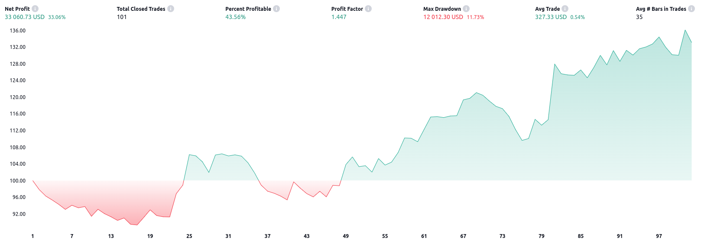
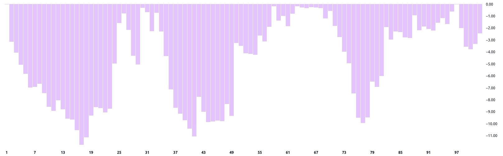
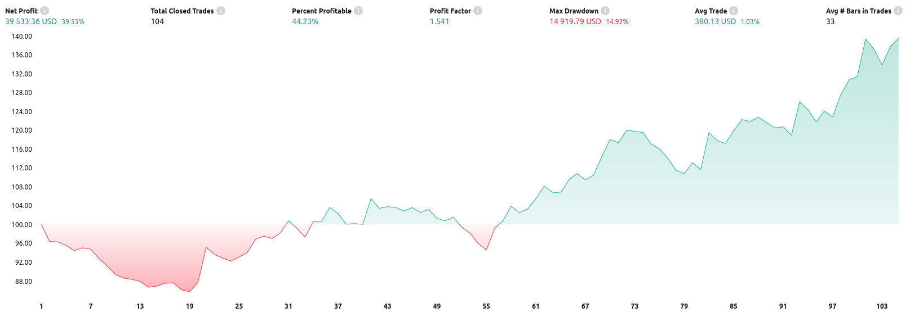
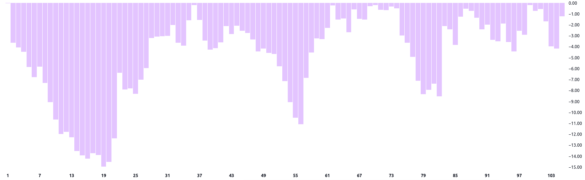
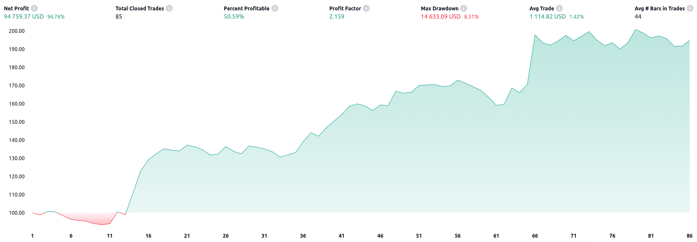
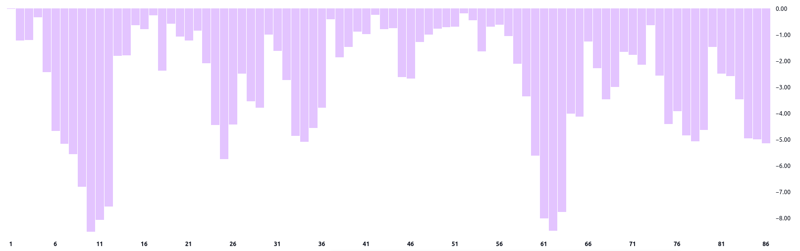
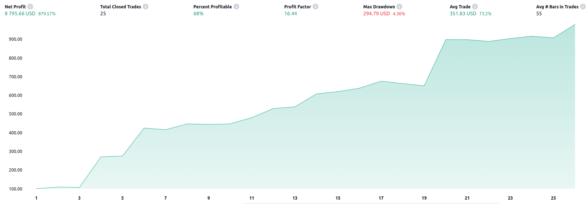
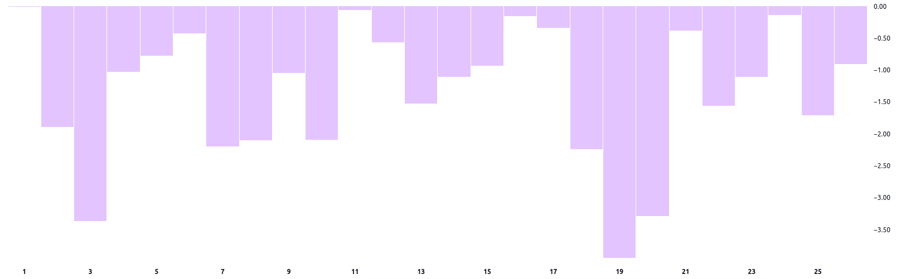
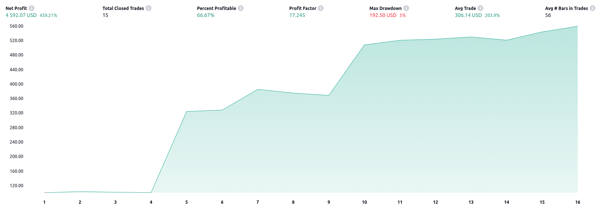
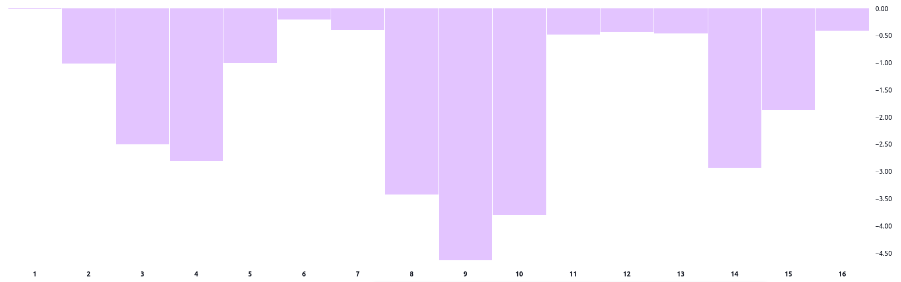

# Supertrend backtest

## Markets
* **SPX**: The S&P 500 Index, also known as the Standard & Poor’s 500 Index, is a market-capitalization-weighted index that tracks the performance of approximately 500 leading publicly traded companies in the United States. 

* **NDQ**: The Nasdaq 100 Index (ticker: NDX) is a stock market index that holds 102 stocks representing 101 non-financial sector companies listed on the Nasdaq exchange. It debuted on January 31, 1985, and has evolved to become a barometer for both U.S. mega-cap stock and technology sector performance.

* **DJI**: The Dow Jones Industrial Average (DJIA), often simply referred to as the Dow, is a prominent stock market index that provides insight into the performance of 30 large publicly traded companies in the United States.

* **BTCUSD**: Bitcoin (BTC) is a decentralized cryptocurrency that was first described in a 2008 whitepaper by an individual or group of individuals using the alias Satoshi Nakamoto. Officially launched in January 2009, Bitcoin is a peer-to-peer online currency that allows transactions to happen directly between equal and independent network participants without the need for any intermediary. Bitcoin is digital money that cannot be inflated or manipulated by any individual, company, government, or central bank. Bitcoin is recognized as one of the initial cryptocurrencies to come into use and has inspired the development of thousands of competing projects. There will only ever be 21 million BTC. Bitcoin is highly divisible, with its smallest unit, i.e. 0.000 000 01 BTC, called a "satoshi" or "sat." As bitcoin's value has risen, its easy divisibility has become a key attribute.

* **ETHUSD**: Ethereum (ETH) is a decentralized, open-source blockchain that aims to become a global platform for decentralized applications and strives to enable users worldwide to write and run software resistant to censorship, downtime, and fraud. As the nonprofit Ethereum Foundation puts it, it "Is for more than payments. It's a marketplace of financial services, games, and apps that can't steal your data or censor you." Ethereum is the second-biggest cryptocurrency by market cap after Bitcoin and a decentralized computing platform that can run a wide variety of applications — including a universe of decentralized finance (or DeFi) apps and services. This platform is powered by its native cryptocurrency, Ether, which is used within the Ethereum network for various operations, making it an integral part of the system.

## Interval
- 30+ years
- 1.1.1990 - 5.5.2024

## SPX
**Inputs**
- Basic settings
    - ATR Length 10
    - FActor: 3
    - Risk per trade: 2%

- Filter settings
    - Enable filter: True
    - Benchmark: SPX

- Time settings
    - From date: 1.1.1990
    - To date: 5.5.2024

- Properties
    - Initial capital: 100 000 USD
    - Pyramiding: 0

**Outputs**
- Net profit: 33.06% (CAGR 0.97%)
- Total count trades: 101 (avg 2-3 trades per year) 
- Percentage profitability: 43.56%
- Profit factor: 1.447
- Ratio Avg Win / Avg Loss: 1.874
- Max drawdown: 11.73%

**Equity**

**Drawdown**

## NDQ
**Inputs**
- Basic settings
    - ATR Length 10
    - FActor: 3
    - Risk per trade: 2%

- Filter settings
    - Enable filter: True
    - Benchmark: SPX

- Time settings
    - From date: 1.1.1990
    - To date: 5.5.2024

- Properties
    - Initial capital: 100 000 USD
    - Pyramiding: 0

**Outputs**
- Net profit: 39.53% (CAGR: 1.16%)
- Total count trades: 104 (avg 3-4 trades per year) 
- Percentage profitability: 44.23%
- Profit factor: 1.541
- Ratio Avg Win / Avg Loss: 1.943
- Max drawdown: 14.92%

**Equity**

**Drawdown**

## DJI
**Inputs**
- Basic settings
    - ATR Length 10
    - FActor: 3
    - Risk per trade: 2%

- Filter settings
    - Enable filter: True
    - Benchmark: SPX

- Time settings
    - From date: 1.1.1990
    - To date: 5.5.2024

- Properties
    - Initial capital: 100 000 USD
    - Pyramiding: 0

**Outputs**
- Net profit: 94.76% (CAGR: 2.78%)
- Total count trades: 85 (avg 2-3 trades per year) 
- Percentage profitability: 46.88%
- Profit factor: 2.159
- Ratio Avg Win / Avg Loss: 2.109
- Max drawdown: 8.51%

**Equity**

**Drawdown**

## BTCUSD
**Inputs**
- Basic settings
    - ATR Length 10
    - FActor: 3
    - Risk per trade: 2%

- Filter settings
    - Enable filter: True
    - Benchmark: BTCUSD

- Time settings
    - From date: 1.1.2009
    - To date: 5.5.2024

- Properties
    - Initial capital: 1 000 USD
    - Pyramiding: 0

**Outputs**
- Net profit: 879.57% (CAGR: 58.64%)
- Total count trades: 25 (avg 1-2 trades per year) 
- Percentage profitability: 68%
- Profit factor: 16.44
- Ratio Avg Win / Avg Loss: 7.737
- Max drawdown: 4.36%

**Equity**

**Drawdown**

## ETHUSD
**Inputs**
- Basic settings
    - ATR Length 10
    - FActor: 3
    - Risk per trade: 2%

- Filter settings
    - Enable filter: True
    - Benchmark: BTCUSD

- Time settings
    - From date: 1.1.2015
    - To date: 5.5.2024

- Properties
    - Initial capital: 1 000 USD
    - Pyramiding: 0

**Outputs**
- Net profit: 459.21% (CAGR: 51.02%)
- Total count trades: 15 (avg 1-2 trades per year) 
- Percentage profitability: 67%
- Profit factor: 17.245
- Ratio Avg Win / Avg Loss: 8.623
- Max drawdown: 5%

**Equity**

**Drawdown**

