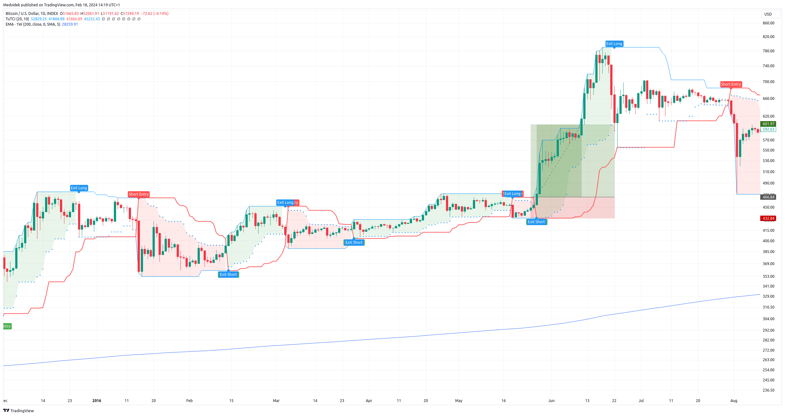
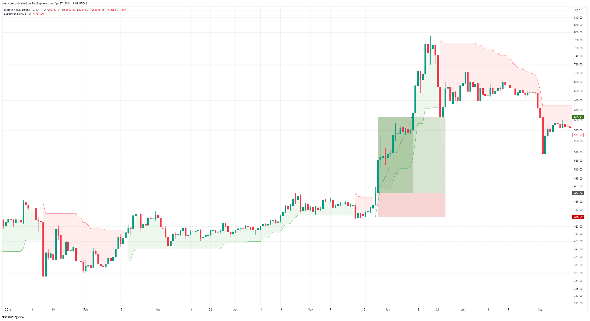

# Trend following strategies

Trend following is when you try to capture extended moves in the financial markets, either up or down, mostly for long-term gains. Once in a while prices tend to keep on going (enduring) and these are the moves trend followers like. The aim is to capture most of such moves, not all, but the majority of them.

**Table of Contents**
* [Intro](#intro)
* [Turtle strategy](#turtle)
* [Supertrend strategy](#supertrend)
* [Bollinger Band Breakout strategy](#bollinger-band-breakout)

## Intro

Trend followers are not trying to predict tops and bottoms. They are not trying to predict anything, really. The aim is, quite simply, to take advantage of moves in different asset classes in the anticipation that some of the positions go their way big time. There is zero forecasting involved.

Trend followers might use different time frames and many asset classes to diversify in order to avoid big drawdowns. Having different strategies is important for a trend follower.

Trending following works best for long-term trends persisting over multiple market cycles, although they can still be exposed to a number of risk factors and short term reversals. Examples of such markets are stock indexes (S&P500, NASDAQ100 or DJI) and the two main cryptocurrencies (Bitcoin and Ethereum).

**Basic rules of trend following**

1. Follow the trend.
2. Quickly exit losing trades at relatively small stop-losses.
3. Let the profits grow until the trend ends.

These three principles are the basic building blocks of all successful trend following strategies. That's not the point
to predict where the market will go, but rather to react to its changes. The goal is to use the big and prominent ones to our advantage
market movements.

<i>"Being fully invested when the market is rising and reverting to cash during a sustained bear market
is not about predicting or timing the market. It’s about reacting to the current market trend and then
positioning oneself accordingly."</i>  Nick Radge

#### What is a trend?

A trend refers to the general direction in which the price of an asset is moving over a period of time. Trends can be classified as upward (bullish), downward (bearish), or sideways (neutral). Traders often try to identify and follow trends to make informed decisions about buying or selling assets.

#### The Turtle Trading Experiment

The history of trend trading would only be complete by mentioning the legendary Turtle trading experiment of the 1980s that popularized the technique. Spearheaded by the visionary commodities trader Richard Dennis, this experiment aimed to prove that trading skills could be taught and anyone could become a successful trader.

Dennis selected a group of inexperienced traders, affectionately called the “Turtles,” and imparted his trend-following system to them. This system relied heavily on technical analysis, encompassing a variety of technical indicators and rigorous risk management techniques. The outcome was nothing short of remarkable.

While precise figures are elusive, some sources suggest that the Turtle traders collectively amassed over $100 million in profits. Several Turtles, including Jerry Parker, who founded Chesapeake Capital, and Paul Rabar, who established Rabar Market Research, became titans of the trading world, generating staggering returns for their clients using the trend trading strategy.


## Turtle
The Turtle Trading strategy was developed by Richard Dennis and William Eckhardt in the early 1980s. Story
relates that Richard Dennis, a successful commodity trader, believed that trading could be taught to anyone and decided
to conduct an experiment to confirm his theory. He created a group of people known as the "Turtles" and taught them his trade
system.

The basic principle of the Turtle Trading strategy is to follow the trend. The goal is to identify and trade strong trends on
financial markets. Turtles learned to buy and hold futures contracts for markets that were in a strong uptrend
and sell short and hold contracts for markets in a strong downtrend. Personally, I think it's better
focus on markets in a long-term up-trend and trade only on the long side.

Author: Richard Denis

#### Entry and exit conditions
**Entry**
* Daily close price is above max 20 days high price

**Exit**
* Daily close price is below min 10 days low price

### Filters
**Simple**
* Daily close price is above 200 day moving average (bullish environment)

**Advance**
* Using Super trend indicator is more accurate determination of medium-term trend changes from bear market to bull market and vice versa.
* Daily close price is above Super trend indicator(Time frame: Weekly, ATR lenght: 10, Factor: 3)



* [Documentation]()
* [Backtest]()
* **SourceCode**: [TradingView](), [cTrader]() [MetaTrader](), [Multicharts](), [TradeStation]()


## Supertrend
The Supertrend Strategy is a trend trading strategy that uses the Supertrend indicator to identify and trade trends in the financial markets. This strategy focuses on entering the market in line with the main trend and exiting the market when the trend begins to reverse.

The basis of the Supertrend strategy is the Supertrend indicator, which determines the direction of the trend and potential entry and exit points. The Supertrend indicator generates signals based on current price data and a certain volatility factor.

Author: Olivier Seban


**Entry**
* Daily close price is above value of  Super trend indicator from previous day

**Exit**
* Daily close price is below value of Super trend indicator from previous day

Super trend indicator parameters: (Time frame: Daily, ATR lenght: 10, Factor: 3)

### Filters
**Simple**
* Daily close price is above 200 day moving average (bullish environment)

**Advance**
* Using Super trend indicator is more accurate determination of medium-term trend changes from bear market to bull market and vice versa.
* Daily close price is above Super trend indicator(Time frame: Weekly, ATR lenght: 10, Factor: 3)



* [Documentation]()
* [Backtest]()
* **SourceCode**: [TradingView](), [cTrader]() [MetaTrader](), [Multicharts](), [TradeStation]()


## Bollinger Band Breakout
The purpose of this strategy is to use the Bollinger Bands to generate trading signals designed to capture powerful breakout price moves and to capitalize on the resulting trends from these breakouts.

The Bollinger Bands are often used for the purpose of generating signals to determine when price is entering over-sold or over-bought areas on the chart, relative to recent price. This strategy utilizes the Bollinger Bands in a completely different way – to identify breakout trade opportunities which often lead to price trending in a defined direction for an extended period of time.

Author: Nick Radge

**Entry**
* Daily close price is above upper band

**Exit**
* Daily close price is below lower band

```C#
int length = 20
double multiplierUpper = 1
double multiplierLower = 0.5
double upperBand = ta.sma(close, length) + multiplierUpper * ta.stdev(close, length)
double lowerBand = ta.sma(close, length) - multiplierLower * ta.stdev(close, length)
```

### Filters
**Simple**
* Daily close price is above 200 day moving average (bullish environment)

**Advance**
* Using Super trend indicator is more accurate determination of medium-term trend changes from bear market to bull market and vice versa.
* Daily close price is above Super trend indicator(Time frame: Weekly, ATR lenght: 10, Factor: 3)


* [Documentation]()
* [Backtest]()
* **SourceCode**: [TradingView](), [cTrader]() [MetaTrader](), [Multicharts](), [TradeStation]()
